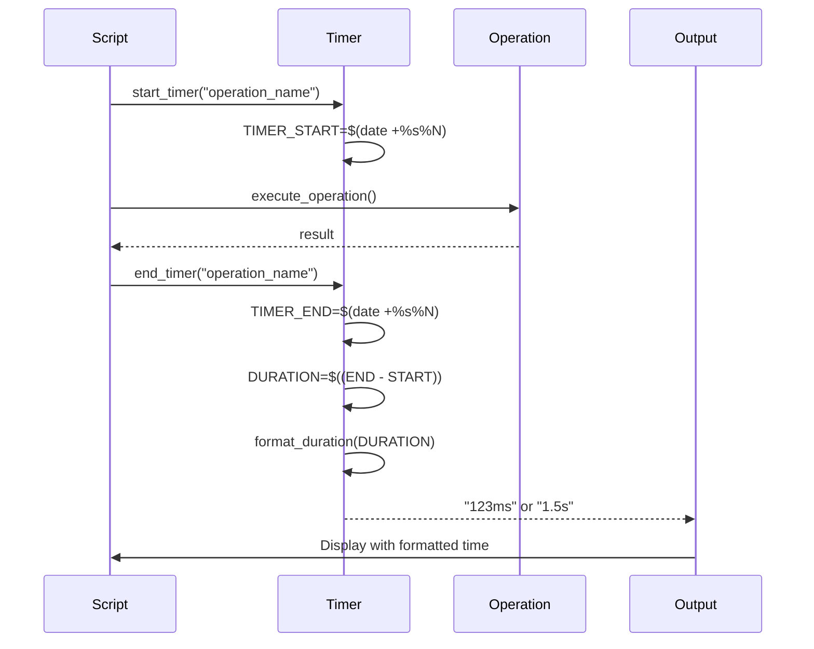

# Design Document - Build Timing Metrics

## Overview

Este documento descreve o design para adicionar medição de tempo humanamente legível aos scripts build.sh e test.sh. A solução implementa funções bash para capturar, calcular e formatar durações de operações, exibindo automaticamente os tempos em unidades apropriadas (ns, ms, s).

## Architecture

### High-Level Design

```
┌─────────────────────────────────────────────────────────┐
│                    build.sh / test.sh                    │
├─────────────────────────────────────────────────────────┤
│                                                           │
│  ┌─────────────────────────────────────────────────┐   │
│  │         Timing Measurement Layer                 │   │
│  │                                                   │   │
│  │  • start_timer()    - Captura tempo inicial     │   │
│  │  • end_timer()      - Calcula duração            │   │
│  │  • format_duration()- Formata para humano        │   │
│  └─────────────────────────────────────────────────┘   │
│                          ↓                               │
│  ┌─────────────────────────────────────────────────┐   │
│  │         Existing Operations                      │   │
│  │                                                   │   │
│  │  • auto_format()                                 │   │
│  │  • run_quality_checks()                          │   │
│  │  • run_tests()                                   │   │
│  │  • build_component()                             │   │
│  │  • build_platform()                              │   │
│  └─────────────────────────────────────────────────┘   │
│                          ↓                               │
│  ┌─────────────────────────────────────────────────┐   │
│  │         Enhanced Output                          │   │
│  │                                                   │   │
│  │  [timestamp] Operation... (123ms)                │   │
│  │  [timestamp] ✓ Success (1.5s)                    │   │
│  └─────────────────────────────────────────────────┘   │
└─────────────────────────────────────────────────────────┘
```

### Timing Flow



## Components and Interfaces

### 1. Timer Management Functions

#### start_timer()
```bash
# Inicia medição de tempo para uma operação
# Parâmetro: nome da operação (usado como chave)
# Armazena tempo em nanosegundos em variável global
start_timer() {
    local timer_name=$1
    local var_name="TIMER_${timer_name}"
    eval "${var_name}=$(date +%s%N)"
}
```

**Responsabilidades:**
- Capturar timestamp atual em nanosegundos usando `date +%s%N`
- Armazenar em variável global com nome baseado na operação
- Permitir múltiplos timers simultâneos com nomes diferentes

#### end_timer()
```bash
# Finaliza medição e retorna duração formatada
# Parâmetro: nome da operação
# Retorna: string formatada (ex: "123ms", "1.5s")
end_timer() {
    local timer_name=$1
    local var_name="TIMER_${timer_name}"
    local start_time=$(eval echo \$${var_name})
    local end_time=$(date +%s%N)
    local duration=$((end_time - start_time))
    
    format_duration $duration
}
```

**Responsabilidades:**
- Recuperar tempo inicial da variável global
- Capturar tempo final
- Calcular duração em nanosegundos
- Chamar format_duration() para formatação
- Retornar string formatada via echo

#### format_duration()
```bash
# Formata duração em nanosegundos para formato legível
# Parâmetro: duração em nanosegundos
# Retorna: string formatada com unidade apropriada
format_duration() {
    local ns=$1
    
    # Menos de 1ms: exibir em nanosegundos
    if [ $ns -lt 1000000 ]; then
        echo "${ns}ns"
    # Entre 1ms e 1s: exibir em milissegundos
    elif [ $ns -lt 1000000000 ]; then
        local ms=$(echo "scale=2; $ns / 1000000" | bc)
        echo "${ms}ms"
    # 1s ou mais: exibir em segundos
    else
        local s=$(echo "scale=2; $ns / 1000000000" | bc)
        echo "${s}s"
    fi
}
```

**Responsabilidades:**
- Receber duração em nanosegundos
- Determinar unidade apropriada baseada no valor
- Converter para unidade escolhida com 2 casas decimais
- Retornar string formatada com sufixo de unidade

### 2. Integration Points

#### auto_format() Enhancement
```bash
auto_format() {
    start_timer "format"
    log_msg "${YELLOW}Formatando código Go automaticamente...${NC}"
    
    if go fmt ./...; then
        local duration=$(end_timer "format")
        log_msg "${GREEN}✓ Código formatado com sucesso${NC} ${BLUE}(${duration})${NC}"
        echo ""
        return 0
    else
        local duration=$(end_timer "format")
        log_msg "${RED}✗ Erro ao formatar código${NC} ${BLUE}(${duration})${NC}"
        echo ""
        return 1
    fi
}
```

#### run_quality_checks() Enhancement
```bash
run_quality_checks() {
    start_timer "quality"
    log_msg "${YELLOW}=== Verificações de Qualidade ===${NC}"
    echo ""
    
    # ... existing checks ...
    
    local duration=$(end_timer "quality")
    log_msg "${GREEN}✓ Todas as verificações de qualidade passaram${NC} ${BLUE}(${duration})${NC}"
    echo ""
    return 0
}
```

#### build_component() Enhancement
```bash
build_component() {
    local component=$1
    local goos=$2
    local goarch=$3
    
    start_timer "build_${component}_${goos}_${goarch}"
    
    # ... existing build logic ...
    
    local duration=$(end_timer "build_${component}_${goos}_${goarch}")
    
    if [ $? -eq 0 ]; then
        log_msg "  ${GREEN}✓${NC} Building ${component} for ${goos}/${goarch} ${BLUE}(${duration})${NC}"
        return 0
    else
        log_msg "  ${RED}✗${NC} Building ${component} for ${goos}/${goarch} ${BLUE}(${duration})${NC}"
        return 1
    fi
}
```

#### build_platform() Enhancement
```bash
build_platform() {
    local platform=$1
    local goos=$(echo $platform | cut -d'/' -f1)
    local goarch=$(echo $platform | cut -d'/' -f2)
    
    start_timer "platform_${goos}_${goarch}"
    log_msg "${YELLOW}=== Building for ${goos}/${goarch} ===${NC}"
    
    # Build all components...
    
    local duration=$(end_timer "platform_${goos}_${goarch}")
    log_msg "${GREEN}✓ Platform ${goos}/${goarch} completed${NC} ${BLUE}(${duration})${NC}"
    echo ""
    return 0
}
```

#### run_tests() Enhancement (test.sh)
```bash
run_tests() {
    start_timer "tests"
    log_msg "${YELLOW}Executando testes...${NC}"
    echo ""
    
    # ... existing test logic ...
    
    local duration=$(end_timer "tests")
    
    if [ $? -eq 0 ]; then
        echo ""
        log_msg "${GREEN}✓ Todos os testes passaram${NC} ${BLUE}(${duration})${NC}"
        return 0
    else
        echo ""
        log_msg "${RED}✗ Alguns testes falharam${NC} ${BLUE}(${duration})${NC}"
        return 1
    fi
}
```

### 3. Total Build Time Tracking

```bash
# No início do script (após parse de argumentos)
start_timer "total"

# No final do script (antes do exit)
TOTAL_DURATION=$(end_timer "total")
log_msg "${GREEN}=== Build Completo ===${NC}"
log_msg "Tempo total de execução: ${BLUE}${TOTAL_DURATION}${NC}"
```

## Data Models

### Timer Storage
```bash
# Variáveis globais para armazenar timestamps
TIMER_format=<nanoseconds>           # Formatação
TIMER_quality=<nanoseconds>          # Quality checks
TIMER_tests=<nanoseconds>            # Testes
TIMER_build_client_linux_amd64=<ns>  # Build específico
TIMER_platform_linux_amd64=<ns>      # Platform total
TIMER_total=<nanoseconds>            # Build completo
```

### Duration Format Examples
```
Input (ns)          Output
─────────────────────────────
500000              500000ns
1500000             1.50ms
50000000            50.00ms
1500000000          1.50s
65000000000         65.00s
```

## Error Handling

### Missing bc Command
```bash
format_duration() {
    local ns=$1
    
    # Verifica se bc está disponível
    if ! command -v bc &> /dev/null; then
        # Fallback: usar apenas divisão inteira
        if [ $ns -lt 1000000 ]; then
            echo "${ns}ns"
        elif [ $ns -lt 1000000000 ]; then
            local ms=$((ns / 1000000))
            echo "${ms}ms"
        else
            local s=$((ns / 1000000000))
            echo "${s}s"
        fi
        return
    fi
    
    # Lógica normal com bc...
}
```

### Timer Not Started
```bash
end_timer() {
    local timer_name=$1
    local var_name="TIMER_${timer_name}"
    local start_time=$(eval echo \$${var_name})
    
    # Verifica se timer foi iniciado
    if [ -z "$start_time" ]; then
        echo "N/A"
        return
    fi
    
    # Lógica normal...
}
```

### Invalid Duration Values
```bash
format_duration() {
    local ns=$1
    
    # Valida input
    if ! [[ "$ns" =~ ^[0-9]+$ ]]; then
        echo "N/A"
        return
    fi
    
    # Lógica normal...
}
```

## Testing Strategy

### Unit Testing Approach

Como os scripts são bash, o teste será manual e baseado em observação:

1. **Teste de Formatação de Duração**
   - Executar format_duration com valores conhecidos
   - Verificar output para diferentes faixas (ns, ms, s)
   - Validar precisão de 2 casas decimais

2. **Teste de Timer Completo**
   - Executar operação com duração conhecida (sleep)
   - Verificar se tempo medido está próximo do esperado
   - Validar formato do output

3. **Teste de Integração**
   - Executar build.sh completo
   - Verificar se todos os tempos são exibidos
   - Validar que cores e formatação são preservadas

### Test Cases

```bash
# Teste 1: Formatação de nanosegundos
format_duration 500000
# Esperado: 500000ns

# Teste 2: Formatação de milissegundos
format_duration 1500000
# Esperado: 1.50ms

# Teste 3: Formatação de segundos
format_duration 1500000000
# Esperado: 1.50s

# Teste 4: Timer com sleep
start_timer "test"
sleep 1
duration=$(end_timer "test")
echo $duration
# Esperado: ~1.00s

# Teste 5: Build completo
./build.sh --test-only
# Verificar: tempos exibidos para formatação, quality checks, testes
```

### Validation Criteria

- Todos os tempos devem ser exibidos em formato legível
- Unidades devem ser apropriadas para cada valor
- Cores e formatação existentes devem ser preservadas
- Tempo total deve ser aproximadamente a soma das partes
- Não deve haver erros de sintaxe bash

## Performance Considerations

### Overhead de Medição

- `date +%s%N` é uma operação rápida (~1ms)
- Overhead total por operação: ~2ms (start + end)
- Impacto negligível em operações que levam segundos

### Otimizações

1. **Evitar Subshells Desnecessários**
   ```bash
   # Ruim: cria subshell
   duration=$(end_timer "test")
   
   # Bom: usa variável diretamente quando possível
   end_timer "test"
   ```

2. **Cache de Comandos**
   ```bash
   # Verificar bc uma vez no início
   HAS_BC=false
   if command -v bc &> /dev/null; then
       HAS_BC=true
   fi
   ```

3. **Minimizar Chamadas a format_duration**
   - Chamar apenas quando necessário exibir
   - Não formatar tempos intermediários desnecessários

## Coverage Files Organization

### Directory Structure

```
project_root/
├── coverage/                    # Novo diretório para arquivos de coverage
│   ├── coverage.out             # Coverage principal
│   ├── coverage.html            # HTML report principal
│   ├── coverage_*.out           # Coverage por pacote
│   ├── coverage_*.html          # HTML reports por pacote
│   └── COVERAGE_ANALYSIS.md     # Análise de coverage
├── build.sh
├── test.sh
└── ...
```

### Implementation

#### test.sh Changes

```bash
# Configurações atualizadas
COVERAGE_DIR="coverage"
COVERAGE_FILE="${COVERAGE_DIR}/coverage.out"
COVERAGE_HTML="${COVERAGE_DIR}/coverage.html"

# Criar diretório no início
mkdir -p "$COVERAGE_DIR"

# Atualizar comandos de coverage
go test -v -race -coverprofile="$COVERAGE_FILE" ./...
go tool cover -func="$COVERAGE_FILE"
go tool cover -html="$COVERAGE_FILE" -o "$COVERAGE_HTML"
```

#### build.sh Changes

```bash
# Função clean_build atualizada
clean_build() {
    log_msg "${YELLOW}Limpando diretório de build...${NC}"
    rm -rf "$BUILD_DIR"
    rm -rf coverage/  # Limpar diretório de coverage
    log_msg "${GREEN}✓ Diretório limpo${NC}"
    echo ""
}
```

### Benefits

1. **Organização**: Todos os arquivos de coverage em um único local
2. **Limpeza**: Raiz do projeto permanece limpa
3. **Gitignore**: Fácil adicionar `/coverage/` ao .gitignore
4. **Manutenção**: Simples limpar todos os arquivos de coverage de uma vez

## File Naming Standardization

### Markdown Files Renaming

Todos os arquivos .md na raiz devem usar letras minúsculas:

```bash
# Renomeações necessárias
COVERAGE_ANALYSIS.md → coverage/coverage_analysis.md
CROSS_PLATFORM_TESTING.md → cross_platform_testing.md
PLATFORM_COMPATIBILITY_SUMMARY.md → platform_compatibility_summary.md
README.md → readme.md
```

### Update References

Após renomear, atualizar referências em:
- Scripts (build.sh, test.sh)
- Outros arquivos markdown
- Documentação

## README Documentation Section

### New Section Structure

```markdown
## Documentação

Este projeto inclui documentação detalhada sobre diferentes aspectos:

### Testes
- [test.md](test.md) - Guia completo de testes unitários, cobertura e estratégias de teste

### Compatibilidade
- [cross_platform_testing.md](cross_platform_testing.md) - Informações sobre testes e compatibilidade entre plataformas
- [platform_compatibility_summary.md](platform_compatibility_summary.md) - Resumo de compatibilidade por plataforma

### Coverage
- [coverage/coverage_analysis.md](coverage/coverage_analysis.md) - Análise detalhada de cobertura de testes
```

### Implementation

1. Adicionar seção "Documentação" no readme.md
2. Incluir links relativos para cada documento
3. Adicionar descrição breve de cada documento
4. Organizar por categoria (Testes, Compatibilidade, Coverage)

## Log Messages Quality Review

### Review Criteria

Todas as mensagens de log em arquivos .go devem seguir estes critérios:

1. **Gramática Correta**
   - Sem erros ortográficos
   - Pontuação adequada
   - Concordância verbal e nominal

2. **Clareza e Didática**
   - Explicar claramente o que aconteceu
   - Incluir contexto relevante
   - Usar linguagem simples e direta

3. **Consistência**
   - Manter padrão de formatação existente
   - Usar prefixos consistentes ([função] mensagem)
   - Manter estilo de capitalização

4. **Contexto para Debugging**
   - Incluir valores de variáveis relevantes
   - Indicar causa do erro quando possível
   - Sugerir ação corretiva quando apropriado

### Examples

#### Before (Problematic)
```go
log.Println("[httpGet] Error:", err)
log.Println("cant read file")
log.Println("[Match] invalid")
```

#### After (Improved)
```go
log.Printf("[httpGet] Failed to fetch URL %s: %v", url, err)
log.Printf("[Config] Unable to read configuration file '%s': %v", filename, err)
log.Printf("[Match] Invalid match data: elapsed time exceeds maximum allowed (%d > %d)", elapsed, maxElapsed)
```

### Review Process

1. **Identificar** todas as mensagens de log em arquivos .go
2. **Avaliar** cada mensagem contra os critérios
3. **Reescrever** mensagens que não atendem aos critérios
4. **Validar** que formatação e estética são mantidas
5. **Testar** que mensagens aparecem corretamente em runtime

## Implementation Notes

### Bash Compatibility

- Usar `date +%s%N` (disponível em GNU date)
- Fallback para `date +%s` em sistemas sem nanosegundos
- Testar em Linux (GNU date) e macOS (BSD date)

### Color Integration

```bash
# Tempo sempre em azul para consistência
BLUE='\033[0;34m'

# Exemplo de uso
log_msg "${GREEN}✓ Success${NC} ${BLUE}(${duration})${NC}"
```

### Positioning in Output

```bash
# Padrão: tempo no final da linha entre parênteses
[timestamp] ✓ Operation completed (1.5s)

# Para operações longas: tempo em linha separada
[timestamp] === Building for all platforms ===
[timestamp] ✓ Platform linux/amd64 completed (5.2s)
[timestamp] ✓ Platform windows/amd64 completed (4.8s)
[timestamp] Total build time: (10.0s)
```

## Migration Path

### Phase 1: Core Functions
1. Implementar format_duration()
2. Implementar start_timer() e end_timer()
3. Testar funções isoladamente

### Phase 2: build.sh Integration
1. Adicionar timing a auto_format()
2. Adicionar timing a run_quality_checks()
3. Adicionar timing a build_component()
4. Adicionar timing a build_platform()
5. Adicionar timing total

### Phase 3: test.sh Integration
1. Adicionar timing a run_tests()
2. Adicionar timing total

### Phase 4: Validation
1. Testar todos os cenários de uso
2. Validar output em diferentes plataformas
3. Documentar comportamento
