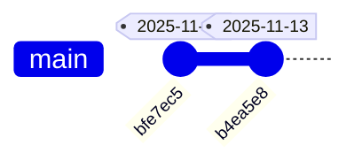

# Documento de Design

## Visão Geral

O Gerador de Changelog é um script bash (make-changelog.sh) que analisa o histórico completo de commits do repositório Git usando comandos nativos e gera automaticamente um arquivo CHANGELOG.md estruturado. O script prioriza a análise de diffs de código para entender os resultados reais de cada commit, ao invés de confiar apenas nas mensagens de commit.

O script segue os mesmos padrões de logging e estrutura dos scripts build.sh e test.sh existentes, incluindo:
- Funções de logging com timestamp e duração (log_msg, start_timer, end_timer, format_duration)
- Cores padronizadas (GREEN, RED, YELLOW, BLUE, BOLD, NC)
- Tratamento de erros com set -e
- Medição de tempo de execução

O documento gerado contém (nesta ordem):
1. Um diagrama Mermaid gitGraph mostrando uma timeline vertical dos commits
2. Uma tabela resumo com data/hora, mensagem e resumo das mudanças
3. Seções detalhadas mas concisas para cada commit

Todos os commits são exibidos do mais recente para o mais antigo.

## Arquitetura

### Estrutura do Script

```
make-changelog.sh
├── Funções Utilitárias (copiadas de build.sh/test.sh)
│   ├── log_msg()           - Logging com timestamp e duração
│   ├── format_duration()   - Formata nanosegundos para legível
│   ├── start_timer()       - Inicia medição de tempo
│   └── end_timer()         - Finaliza e retorna duração
│
├── Funções de Análise Git
│   ├── get_all_commits()   - Lista commits em ordem cronológica
│   ├── analyze_commit()    - Analisa diff e classifica mudanças
│   └── classify_change()   - Determina tipo baseado em arquivos
│
├── Funções de Geração Markdown
│   ├── generate_header()   - Gera cabeçalho do documento
│   ├── generate_table()    - Gera tabela resumo
│   ├── generate_mermaid()  - Gera diagrama gitGraph
│   └── generate_details()  - Gera seções detalhadas
│
└── Main Flow
    ├── Inicializa variáveis e cores
    ├── Coleta dados de commits
    ├── Gera conteúdo markdown
    └── Escreve CHANGELOG.md
```

### Fluxo de Execução

1. Script é chamado (diretamente ou via build.sh)
2. Inicializa funções de logging e cores
3. Executa `git log` (sem --reverse) para obter lista de commits do mais recente ao mais antigo
4. Para cada commit:
   - Extrai metadados (hash, data/hora, mensagem, autor)
   - Executa `git show --name-status` para listar arquivos
   - Classifica tipo de mudança baseado em extensões/caminhos
   - Gera resumo objetivo
5. Constrói documento markdown na ordem:
   - Cabeçalho
   - Diagrama Mermaid gitGraph
   - Tabela resumo
   - Seções detalhadas por commit
6. Escreve arquivo CHANGELOG.md
7. Exibe duração total

### Integração com build.sh

O script build.sh será modificado para:
1. Aceitar flag `--no-changelog`
2. Executar `./make-changelog.sh` antes das verificações de qualidade
3. Continuar build mesmo se changelog falhar (não crítico)
4. Logar início e fim da geração do changelog

## Componentes e Funções

### 1. Funções Utilitárias (Logging e Timing)

Copiadas dos scripts build.sh e test.sh para manter consistência.

```bash
# Cores
RED='\033[0;31m'
GREEN='\033[0;32m'
YELLOW='\033[1;33m'
BLUE='\033[0;34m'
BOLD='\033[1m'
NC='\033[0m'

# Logging com timestamp e duração opcional
log_msg() {
    local message="$1"
    local duration="$2"
    local timestamp=$(date '+%Y-%m-%d %H:%M:%S')
    
    if [ -n "$duration" ]; then
        printf "${GREEN}${BOLD}[%s]${NC} ${BLUE}%12s${NC} :: %b\n" "$timestamp" "$duration" "$message"
    else
        echo -e "${GREEN}${BOLD}[${timestamp}]${NC} ${message}"
    fi
}

# Funções de timing
format_duration() { ... }  # Formata nanosegundos
start_timer() { ... }      # Inicia timer
end_timer() { ... }        # Retorna duração formatada
```

### 2. Funções de Análise Git

```bash
# Obtém todos os commits do mais recente ao mais antigo
get_all_commits() {
    # Formato: hash|short_hash|datetime|message|author
    git log --format="%H|%h|%ad|%s|%an" --date=format:"%Y-%m-%d %H:%M:%S"
}

# Obtém arquivos modificados em um commit
get_commit_files() {
    local hash=$1
    # Formato: status filename
    git show --name-status --format="" "$hash"
}

# Classifica tipo de mudança baseado em arquivos
classify_change() {
    local files=$1
    
    # Verifica padrões nos nomes de arquivos
    if echo "$files" | grep -q "_test\.go\|test\.sh"; then
        echo "Testes"
    elif echo "$files" | grep -q "\.md$\|docs/"; then
        echo "Documentação"
    elif echo "$files" | grep -q "\.sh$\|makefile\|\.yml$\|\.yaml$"; then
        echo "Configuração"
    elif echo "$files" | grep -q "internal/\|cmd/"; then
        echo "Implementação"
    else
        echo "Outros"
    fi
}

# Gera resumo objetivo baseado em arquivos modificados
generate_summary() {
    local files=$1
    local change_type=$2
    
    # Conta arquivos por tipo
    local go_files=$(echo "$files" | grep -c "\.go$" || echo "0")
    local test_files=$(echo "$files" | grep -c "_test\.go$" || echo "0")
    local doc_files=$(echo "$files" | grep -c "\.md$" || echo "0")
    
    # Gera resumo baseado no tipo
    case "$change_type" in
        "Testes")
            echo "Adicionados/atualizados testes ($test_files arquivos)"
            ;;
        "Documentação")
            echo "Atualização de documentação ($doc_files arquivos)"
            ;;
        "Implementação")
            echo "Implementação de funcionalidades ($go_files arquivos)"
            ;;
        *)
            echo "Mudanças gerais no código"
            ;;
    esac
}
```

### 3. Funções de Geração Markdown

```bash
# Gera cabeçalho do documento
generate_header() {
    cat << EOF
# CHANGELOG

Este documento contém o histórico completo de mudanças do projeto.
Gerado automaticamente a partir do histórico Git.

EOF
}

# Gera tabela resumo
generate_table() {
    echo "## Resumo de Mudanças"
    echo ""
    echo "| Data/Hora | Commit | Mensagem | Resumo das Mudanças |"
    echo "|-----------|--------|----------|---------------------|"
    
    # Para cada commit, adiciona linha na tabela
    while IFS='|' read -r hash short_hash datetime message author; do
        local files=$(get_commit_files "$hash")
        local change_type=$(classify_change "$files")
        local summary=$(generate_summary "$files" "$change_type")
        
        echo "| $datetime | \`$short_hash\` | $message | $summary |"
    done
    
    echo ""
}

# Gera diagrama Mermaid gitGraph
generate_mermaid() {
    echo "## Timeline de Commits"
    echo ""
    echo '```mermaid'
    echo "gitGraph"
    
    # Para cada commit, adiciona ao gitGraph
    while IFS='|' read -r hash short_hash datetime message author; do
        # Extrai apenas a data (YYYY-MM-DD) do datetime
        local date=$(echo "$datetime" | cut -d' ' -f1)
        # Escapa aspas na mensagem
        local safe_message=$(echo "$message" | sed 's/"/\\"/g')
        echo "    commit id: \"$short_hash\" tag: \"$date\""
    done
    
    echo '```'
    echo ""
}

# Gera seções detalhadas
generate_details() {
    echo "## Detalhes dos Commits"
    echo ""
    
    while IFS='|' read -r hash short_hash date message author; do
        local files=$(get_commit_files "$hash")
        local change_type=$(classify_change "$files")
        local summary=$(generate_summary "$files" "$change_type")
        local file_count=$(echo "$files" | wc -l)
        
        echo "### [\`$short_hash\`] - $date"
        echo ""
        echo "**Mensagem:** $message"
        echo ""
        echo "**Autor:** $author"
        echo ""
        echo "**Tipo:** $change_type"
        echo ""
        echo "**Resumo:** $summary"
        echo ""
        echo "**Arquivos modificados:** $file_count"
        echo ""
        echo "---"
        echo ""
    done
}
```

## Estrutura do CHANGELOG.md Gerado

```markdown
# CHANGELOG

Este documento contém o histórico completo de mudanças do projeto.
Gerado automaticamente a partir do histórico Git.

## Timeline de Commits



## Resumo de Mudanças

| Data/Hora | Commit | Mensagem | Resumo das Mudanças |
|-----------|--------|----------|---------------------|
| 2025-11-14 15:30:45 | `bfe7ec5` | Log improve | Melhorias no sistema de logging (3 arquivos) |
| 2025-11-13 10:20:15 | `b4ea5e8` | Improve build script | Atualização de scripts de build (2 arquivos) |

### [`bfe7ec5`] - 2025-11-14 15:30:45

**Mensagem:** Log improve

**Autor:** João Silva

**Tipo:** Implementação

**Resumo:** Melhorias no sistema de logging com formatação padronizada

**Arquivos modificados:** 3

---

### [`b4ea5e8`] - 2025-11-13 10:20:15

**Mensagem:** Improve build script

**Autor:** João Silva

**Tipo:** Configuração

**Resumo:** Atualização de scripts de build e processo de compilação

**Arquivos modificados:** 2

---

```

## Fluxo Principal do Script

```bash
#!/bin/bash
set -e

# 1. Inicialização
source_utility_functions()
initialize_colors()
start_timer "total"

# 2. Coleta de dados
log_msg "Analisando histórico Git..."
start_timer "git_analysis"
commits=$(get_all_commits)
commit_count=$(echo "$commits" | wc -l)
duration=$(end_timer "git_analysis")
log_msg "Encontrados $commit_count commits" "$duration"

# 3. Geração do conteúdo
log_msg "Gerando CHANGELOG.md..."
start_timer "generation"

{
    generate_header
    echo "$commits" | generate_mermaid
    echo "$commits" | generate_table
    echo "$commits" | generate_details
} > CHANGELOG.md

duration=$(end_timer "generation")
log_msg "CHANGELOG.md gerado com sucesso" "$duration"

# 4. Finalização
total_duration=$(end_timer "total")
log_msg "✓ Geração completa" "$total_duration"
```

## Tratamento de Erros

### Erros do Git

```bash
# Verifica se está em repositório Git
if ! git rev-parse --git-dir > /dev/null 2>&1; then
    log_msg "${RED}✗ Erro: Não é um repositório Git${NC}"
    exit 1
fi

# Verifica se há commits
if ! git log -1 > /dev/null 2>&1; then
    log_msg "${YELLOW}⚠ Aviso: Repositório sem commits${NC}"
    exit 0
fi
```

### Erros de Análise

- **Commit sem arquivos:** Usar mensagem "Commit vazio ou merge"
- **Classificação incerta:** Usar tipo "Outros" com resumo genérico
- **Caracteres especiais:** Escapar aspas e pipes em mensagens

### Erros de I/O

```bash
# Verifica permissão de escrita
if [ ! -w . ]; then
    log_msg "${RED}✗ Erro: Sem permissão de escrita no diretório${NC}"
    exit 1
fi

# Sobrescreve arquivo existente
if [ -f CHANGELOG.md ]; then
    log_msg "${YELLOW}Sobrescrevendo CHANGELOG.md existente${NC}"
fi
```

## Integração com build.sh

### Modificações no build.sh

```bash
# Adicionar flag no parse de argumentos
NO_CHANGELOG=false

while [[ $# -gt 0 ]]; do
    case $1 in
        --no-changelog)
            NO_CHANGELOG=true
            shift
            ;;
        # ... outras flags
    esac
done

# Adicionar execução antes das verificações de qualidade
if [ "$NO_CHANGELOG" = false ]; then
    if [ -f "./make-changelog.sh" ]; then
        log_msg "${YELLOW}Gerando CHANGELOG.md...${NC}"
        if ./make-changelog.sh; then
            log_msg "${GREEN}✓ CHANGELOG.md atualizado${NC}"
        else
            log_msg "${YELLOW}⚠ Falha ao gerar CHANGELOG (continuando build)${NC}"
        fi
        echo ""
    fi
fi

# Continua com verificações de qualidade...
```

### Atualização do help no build.sh

```bash
usage() {
    echo "Opções:"
    echo "  --no-changelog      Pula geração do CHANGELOG.md"
    # ... outras opções
}
```

## Estratégia de Testes

### Testes Manuais

1. **Teste Básico**
   ```bash
   ./make-changelog.sh
   # Verificar se CHANGELOG.md foi criado
   # Verificar estrutura do documento
   ```

2. **Teste de Integração com build.sh**
   ```bash
   ./build.sh
   # Verificar se changelog foi gerado automaticamente
   
   ./build.sh --no-changelog
   # Verificar se changelog foi pulado
   ```

3. **Validação de Formato**
   - Abrir CHANGELOG.md no GitHub/GitLab
   - Verificar renderização da tabela
   - Verificar renderização do diagrama Mermaid
   - Verificar ordenação cronológica

4. **Validação de Conteúdo**
   - Verificar se todos os commits estão presentes
   - Verificar se datas estão corretas
   - Verificar se resumos são objetivos e didáticos
   - Verificar se classificações fazem sentido

### Testes de Erro

```bash
# Teste fora de repositório Git
cd /tmp
./make-changelog.sh
# Deve exibir erro claro

# Teste sem permissão de escrita
chmod -w .
./make-changelog.sh
# Deve exibir erro de permissão

# Teste em repositório vazio
git init test-repo
cd test-repo
../make-changelog.sh
# Deve lidar graciosamente com ausência de commits
```

## Considerações de Performance

- **Repositórios grandes:** Script pode levar alguns segundos para repositórios com milhares de commits
- **Otimização:** Usar `git log` com formato customizado reduz parsing
- **I/O:** Geração incremental do arquivo usando redirecionamento `>` e `>>`
- **Memória:** Processar commits em stream ao invés de carregar todos na memória

## Decisões de Design

### Por que Bash ao invés de Go?
- Simplicidade: não requer compilação ou dependências
- Comandos Git nativos: mais direto que usar bibliotecas
- Consistência: mantém padrão dos scripts existentes (build.sh, test.sh)
- Portabilidade: funciona em qualquer sistema Unix-like

### Por que não usar biblioteca Git nativa?
- Comandos git CLI são mais simples e diretos
- Menos dependências
- Suficiente para os requisitos
- Mais fácil de debugar e manter

### Por que Mermaid gitGraph?
- Suportado nativamente pelo GitHub/GitLab
- Sintaxe simples e legível
- Renderização automática em visualizadores markdown
- Representação visual clara da timeline

### Por que análise de arquivos ao invés de mensagens?
- Mensagens de commit podem ser imprecisas ou genéricas
- Arquivos modificados mostram mudanças reais
- Permite classificação automática baseada em padrões
- Resumos mais objetivos e consistentes

### Por que integrar com build.sh?
- Garante que changelog está sempre atualizado antes do build
- Automatiza processo de documentação
- Permite pular quando necessário (--no-changelog)
- Não bloqueia build se falhar (não crítico)
