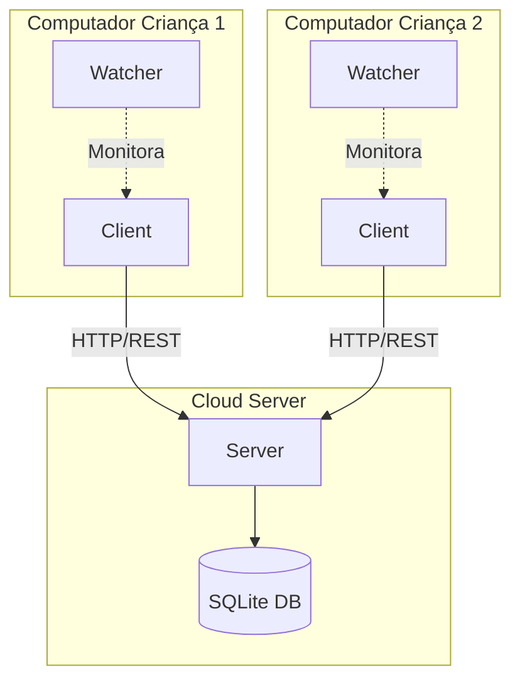
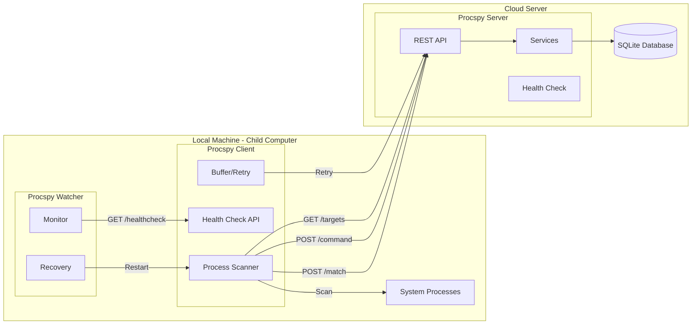
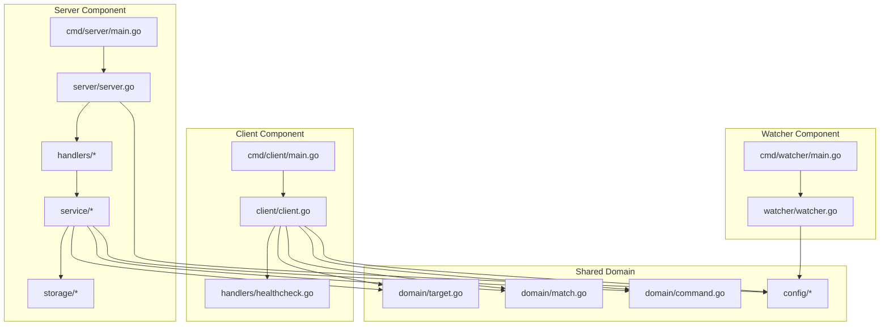
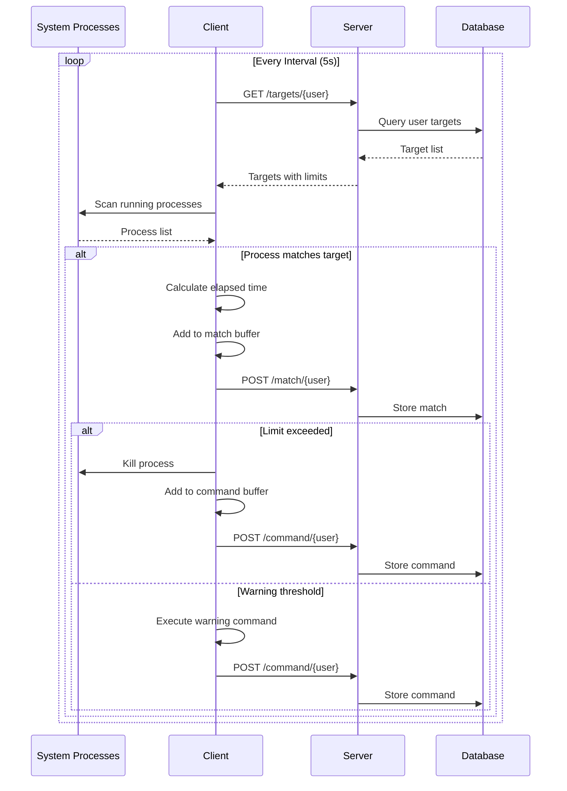
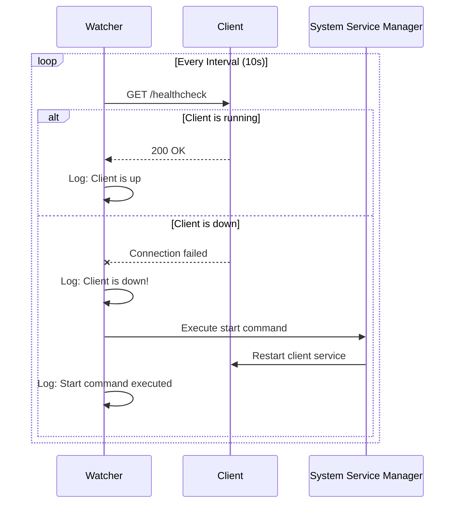
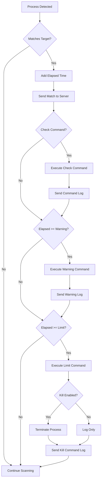
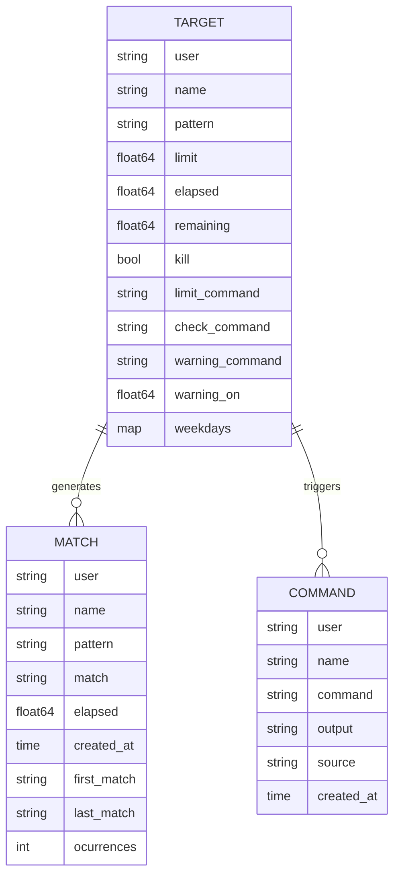
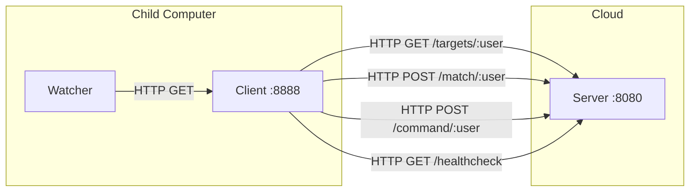

# Design Document - Procspy Documentation

## Overview

Este documento descreve o design da documentação completa do sistema Procspy. A documentação será criada em formato Markdown com diagramas Mermaid integrados, fornecendo uma visão abrangente da arquitetura, componentes, fluxos de dados e operação do sistema de controle parental.

## Architecture

A documentação será estruturada em um único arquivo README.md abrangente, organizado em seções hierárquicas que cobrem desde a visão geral até detalhes técnicos de implementação.

### Documentation Structure

```
README.md
├── 1. Visão Geral
│   ├── Propósito do Sistema
│   ├── Componentes Principais
│   └── Diagrama de Arquitetura de Alto Nível
├── 2. Arquitetura do Sistema
│   ├── Diagrama de Deployment
│   ├── Diagrama de Componentes
│   ├── Comunicação entre Componentes
│   └── Fluxo de Dados
├── 3. Componentes Detalhados
│   ├── Client (Procspy-Client)
│   ├── Server (Procspy-Server)
│   └── Watcher (Procspy-Watcher)
├── 4. Modelos de Dados
│   ├── Target
│   ├── Match
│   ├── Command
│   └── Diagrama de Entidades
├── 5. API REST
│   ├── Endpoints do Server
│   └── Exemplos de Requisições
├── 6. Fluxos Operacionais
│   ├── Ciclo de Monitoramento
│   ├── Aplicação de Limites
│   ├── Sistema de Avisos
│   └── Recuperação pelo Watcher
├── 7. Configuração
│   ├── Configuração do Client
│   ├── Configuração do Server
│   ├── Configuração do Watcher
│   └── Configuração de Targets
├── 8. Suporte Cross-Platform
│   ├── Windows, Linux e macOS
│   ├── Process Killing em Diferentes OS
│   └── Serviços do Sistema
├── 9. Instalação e Deployment
│   ├── Build do Sistema
│   ├── Scripts de Instalação (./install/)
│   ├── Instalação no Windows (NSSM)
│   ├── Instalação no Linux (systemctl)
│   └── Deployment do Server em Cloud
├── 10. Operação e Monitoramento
│   ├── Iniciando os Componentes
│   ├── Gerenciamento de Serviços
│   ├── Monitoramento de Logs
│   └── Troubleshooting
└── 11. Estrutura do Projeto
    ├── Diretórios
    ├── Scripts de Instalação (./install/)
    └── Organização do Código
```

## Components and Interfaces

### Mermaid Diagrams

A documentação incluirá os seguintes diagramas Mermaid:

#### 1. High-Level Architecture Diagram
Mostra a distribuição dos componentes entre computadores das crianças e servidor cloud.

#### 2. Deployment Diagram
Ilustra como Client e Watcher são instalados localmente, e Server está em cloud.

#### 3. Component Diagram
Detalha os módulos internos de cada componente (handlers, services, storage, domain).

#### 4. Sequence Diagram - Monitoring Cycle
Mostra a sequência de operações durante um ciclo de monitoramento.

#### 5. Sequence Diagram - Watcher Recovery
Ilustra como o Watcher detecta falha do Client e reinicia o serviço.

#### 6. Flowchart - Limit Enforcement
Mostra o processo de decisão quando um limite é atingido.

#### 7. Data Model Diagram
Representa as entidades Target, Match e Command com seus relacionamentos.

#### 8. Network Communication Diagram
Mostra as comunicações HTTP/REST entre componentes.

## Data Models

### Diagram Specifications

#### High-Level Architecture


#### Deployment Diagram


#### Component Internal Structure


#### Monitoring Cycle Sequence


#### Watcher Recovery Sequence


#### Limit Enforcement Flow


#### Data Model


#### Network Communication


### Content Sections

#### Section 1: Visão Geral
- Descrição do propósito: controle parental de tempo de tela
- Lista de aplicações monitoradas: jogos, browsers, players de vídeo
- Explicação dos três componentes e onde são instalados
- Diagrama de arquitetura de alto nível

#### Section 2: Arquitetura do Sistema
- Diagrama de deployment mostrando distribuição física
- Diagrama de componentes internos
- Descrição da comunicação REST entre componentes
- Fluxo de dados desde detecção até armazenamento

#### Section 3: Componentes Detalhados

**Client:**
- Função: monitorar processos localmente
- Plataformas: Windows, Linux, macOS
- Tecnologias: Go, gin-gonic, go-ps
- Execução: Como serviço do sistema (NSSM no Windows, systemctl no Linux)
- Funcionalidades:
  - Scan de processos a cada intervalo
  - Matching com regex patterns
  - Cálculo de tempo acumulado
  - Aplicação de limites (kill process cross-platform)
  - Sistema de avisos
  - Buffer e retry para API calls
  - Health check endpoint

**Server:**
- Função: centralizar telemetria e fornecer configurações
- Tecnologias: Go, gin-gonic, SQLite
- Funcionalidades:
  - REST API para receber matches e commands
  - Armazenamento em SQLite
  - Fornecimento de targets por usuário
  - Geração de relatórios
  - Health check endpoint

**Watcher:**
- Função: garantir que Client não seja fechado
- Plataformas: Windows, Linux, macOS
- Tecnologias: Go, HTTP client
- Execução: Como serviço do sistema (NSSM no Windows, systemctl no Linux)
- Funcionalidades:
  - Verificação periódica do health check do Client
  - Execução de comando de restart quando Client está down (cross-platform)
  - Logging de status

#### Section 4: Modelos de Dados
- Descrição detalhada de cada campo do Target
- Descrição detalhada de cada campo do Match
- Descrição detalhada de cada campo do Command
- Diagrama ER mostrando relacionamentos
- Explicação do schema SQLite

#### Section 5: API REST
Documentação de cada endpoint:
- `GET /targets/:user` - Retorna lista de targets para o usuário
- `POST /match/:user` - Registra uma detecção de processo
- `POST /command/:user` - Registra execução de comando
- `GET /report/:user` - Retorna relatório de uso
- `GET /healthcheck` - Verifica saúde do serviço

#### Section 6: Fluxos Operacionais
- Flowchart do ciclo de monitoramento
- Sequence diagram da aplicação de limites
- Flowchart do sistema de avisos
- Sequence diagram da recuperação pelo Watcher
- Explicação do mecanismo de buffer/retry

#### Section 7: Configuração
Documentação detalhada de cada arquivo de configuração:

**config-client.json:**
```json
{
    "user": "nome_crianca",
    "log_path": "logs",
    "debug": false,
    "interval": 5,
    "server_url": "https://servidor.com/procspy",
    "api_host": "localhost",
    "api_port": 8888
}
```

**config-server.json:**
```json
{
    "debug": false,
    "log_path": "logs",
    "db_path": "data",
    "api_port": 8080,
    "api_host": "0.0.0.0",
    "user_targets": {
        "crianca1": "https://url/targets1.json",
        "crianca2": "https://url/targets2.json"
    }
}
```

**watcher-config.json:**
```json
{
    "log_path": "logs",
    "interval": 10,
    "procspy_url": "http://localhost:8888/healthcheck",
    "start_cmd": "systemctl restart procspy-client"
}
```

**user-targets.json:**
```json
{
    "targets": [
        {
            "name": "games",
            "pattern": "roblox|steam|wine|cs.exe",
            "kill": true,
            "weekdays": {
                "0": 2.0,
                "1": 0.5,
                "6": 2.0
            }
        }
    ]
}
```

Explicação de cada campo e opções disponíveis.

#### Section 8: Suporte Cross-Platform

**Plataformas Suportadas:**
- Windows (7, 8, 10, 11, Server)
- Linux (Ubuntu, Debian, CentOS, RHEL, etc)
- macOS (10.12+)

**Process Killing Cross-Platform:**
- Go fornece `os.FindProcess()` e `Process.Kill()` que funcionam em todos os sistemas
- Windows: usa TerminateProcess via syscall
- Linux/macOS: usa SIGKILL via syscall

**Serviços do Sistema:**

Windows:
- Usa NSSM (Non-Sucking Service Manager)
- Permite executar qualquer executável como serviço do Windows
- Gerenciamento via `nssm install/start/stop/remove`
- Configuração de restart automático

Linux:
- Usa systemd/systemctl
- Arquivos .service em /etc/systemd/system/
- Gerenciamento via `systemctl start/stop/enable/disable`
- Configuração de restart automático

macOS:
- Pode usar launchd (similar ao systemd)
- Arquivos .plist em /Library/LaunchDaemons/
- Gerenciamento via `launchctl load/unload`

#### Section 9: Instalação e Deployment

**Estrutura de Scripts:**
```
install/
├── windows/
│   ├── install-client.ps1
│   ├── install-watcher.ps1
│   ├── uninstall-client.ps1
│   └── uninstall-watcher.ps1
├── linux/
│   ├── install-client.sh
│   ├── install-watcher.sh
│   ├── install-server.sh
│   ├── procspy-client.service
│   ├── procspy-watcher.service
│   ├── procspy-server.service
│   ├── uninstall-client.sh
│   ├── uninstall-watcher.sh
│   └── uninstall-server.sh
└── README.md
```

**Build:**
```bash
# Build all components
./build.sh

# Or build individually
go build -o bin/procspy-client cmd/client/main.go
go build -o bin/procspy-server cmd/server/main.go
go build -o bin/procspy-watcher cmd/watcher/main.go
```

**Instalação no Windows:**
1. Baixar NSSM (https://nssm.cc/)
2. Executar script PowerShell: `.\install\windows\install-client.ps1`
3. Executar script PowerShell: `.\install\windows\install-watcher.ps1`
4. Scripts automaticamente:
   - Copiam binários para C:\Program Files\Procspy\
   - Criam arquivos de configuração
   - Instalam serviços usando NSSM
   - Iniciam serviços
5. Verificar serviços: `services.msc` ou `nssm status procspy-client`

**Instalação no Linux (Client/Watcher):**
1. Executar script: `sudo ./install/linux/install-client.sh`
2. Executar script: `sudo ./install/linux/install-watcher.sh`
3. Scripts automaticamente:
   - Copiam binários para /usr/local/bin/
   - Criam arquivos de configuração em /etc/procspy/
   - Copiam arquivos .service para /etc/systemd/system/
   - Habilitam e iniciam serviços
4. Verificar serviços: `systemctl status procspy-client`

**Deployment do Server (Linux):**
1. Preparar servidor cloud (VPS, AWS, etc)
2. Executar script: `sudo ./install/linux/install-server.sh`
3. Script automaticamente:
   - Copia binário para /usr/local/bin/
   - Cria arquivo de configuração em /etc/procspy/
   - Copia arquivo .service para /etc/systemd/system/
   - Habilita e inicia serviço
4. Configurar firewall: `sudo ufw allow 8080/tcp`
5. Configurar proxy reverso (nginx/apache) para HTTPS
6. Verificar serviço: `systemctl status procspy-server`

**Exemplos de Scripts:**

install-client.ps1 (Windows):
```powershell
# Install Procspy Client as Windows Service using NSSM
$serviceName = "procspy-client"
$installPath = "C:\Program Files\Procspy"
$exePath = "$installPath\procspy-client.exe"
$configPath = "$installPath\config-client.json"

# Create directory
New-Item -ItemType Directory -Force -Path $installPath

# Copy files
Copy-Item ".\bin\procspy-client.exe" -Destination $exePath
Copy-Item ".\etc\config-client.json" -Destination $configPath

# Install service with NSSM
nssm install $serviceName $exePath $configPath
nssm set $serviceName AppDirectory $installPath
nssm set $serviceName DisplayName "Procspy Client"
nssm set $serviceName Description "Procspy process monitoring client"
nssm set $serviceName Start SERVICE_AUTO_START
nssm set $serviceName AppRestartDelay 5000

# Start service
nssm start $serviceName

Write-Host "Procspy Client installed and started successfully"
```

install-client.sh (Linux):
```bash
#!/bin/bash
# Install Procspy Client as systemd service

SERVICE_NAME="procspy-client"
INSTALL_DIR="/usr/local/bin"
CONFIG_DIR="/etc/procspy"
SERVICE_FILE="/etc/systemd/system/${SERVICE_NAME}.service"

# Copy binary
sudo cp ./bin/procspy-client $INSTALL_DIR/
sudo chmod +x $INSTALL_DIR/procspy-client

# Create config directory
sudo mkdir -p $CONFIG_DIR
sudo cp ./etc/config-client.json $CONFIG_DIR/

# Copy service file
sudo cp ./install/linux/procspy-client.service $SERVICE_FILE

# Reload systemd
sudo systemctl daemon-reload

# Enable and start service
sudo systemctl enable $SERVICE_NAME
sudo systemctl start $SERVICE_NAME

echo "Procspy Client installed and started successfully"
systemctl status $SERVICE_NAME
```

procspy-client.service:
```ini
[Unit]
Description=Procspy Client - Process Monitoring
After=network.target

[Service]
Type=simple
User=root
ExecStart=/usr/local/bin/procspy-client /etc/procspy/config-client.json
Restart=always
RestartSec=5

[Install]
WantedBy=multi-user.target
```

#### Section 10: Operação e Monitoramento

**Gerenciamento de Serviços:**

Windows:
```powershell
# Status
nssm status procspy-client
nssm status procspy-watcher

# Start/Stop
nssm start procspy-client
nssm stop procspy-client

# Restart
nssm restart procspy-client

# Remove
nssm remove procspy-client confirm
```

Linux:
```bash
# Status
systemctl status procspy-client
systemctl status procspy-watcher
systemctl status procspy-server

# Start/Stop
sudo systemctl start procspy-client
sudo systemctl stop procspy-client

# Restart
sudo systemctl restart procspy-client

# Enable/Disable auto-start
sudo systemctl enable procspy-client
sudo systemctl disable procspy-client
```

**Iniciando Manualmente (para testes):**
```bash
# Client
./procspy-client etc/config-client.json

# Server
./procspy-server etc/config-server.json

# Watcher
./procspy-watcher etc/watcher-config.json
```

**Monitoramento:**
- Localização dos logs
- Interpretação de mensagens de log
- Verificação de health checks
- Acesso a relatórios

**Troubleshooting:**
- Client não inicia
- Watcher não detecta Client
- Server não recebe dados
- Processos não são terminados
- Problemas de conectividade

#### Section 11: Estrutura do Projeto
```
procspy/
├── cmd/
│   ├── client/      # Entry point do Client
│   ├── server/      # Entry point do Server
│   └── watcher/     # Entry point do Watcher
├── internal/
│   └── procspy/
│       ├── client/      # Lógica do Client
│       ├── server/      # Lógica do Server
│       ├── watcher/     # Lógica do Watcher
│       ├── config/      # Configurações
│       ├── domain/      # Modelos de dados
│       ├── handlers/    # HTTP handlers
│       ├── service/     # Lógica de negócio
│       └── storage/     # Acesso a dados
├── install/         # Scripts de instalação
│   ├── windows/     # Scripts PowerShell para Windows
│   ├── linux/       # Scripts Bash e arquivos .service
│   └── README.md    # Guia de instalação
├── etc/             # Arquivos de configuração exemplo
├── bin/             # Binários compilados (gerado)
├── logs/            # Logs (gerado em runtime)
├── data/            # Database (gerado em runtime)
└── go.mod           # Dependências Go
```

## Error Handling

A documentação incluirá:
- Tratamento de erros de conexão (retry mechanism)
- Comportamento quando Server está indisponível
- Recuperação de falhas do Client pelo Watcher
- Logs de erro e como interpretá-los

## Testing Strategy

A documentação não incluirá testes automatizados, mas fornecerá:
- Cenários de teste manual
- Como verificar se cada componente está funcionando
- Como testar o fluxo completo
- Como simular falhas para testar recuperação

## Implementation Notes

### Markdown Structure
- Usar headers hierárquicos (# ## ### ####)
- Incluir table of contents no início
- Usar code blocks com syntax highlighting
- Incluir badges para tecnologias usadas
- Adicionar links internos para navegação

### Mermaid Diagrams
- Todos os diagramas serão em blocos ```mermaid
- Usar cores e estilos para melhor visualização
- Incluir legendas quando necessário
- Garantir que sejam renderizáveis no GitHub

### Language
- Documentação em Português (Brasil)
- Termos técnicos em inglês quando apropriado
- Exemplos práticos e claros
- Tom acessível para pais/administradores não técnicos nas seções de uso

### File Organization
- Um único arquivo README.md na raiz do projeto
- Substituir o README.md existente
- Manter backup do README original se necessário
