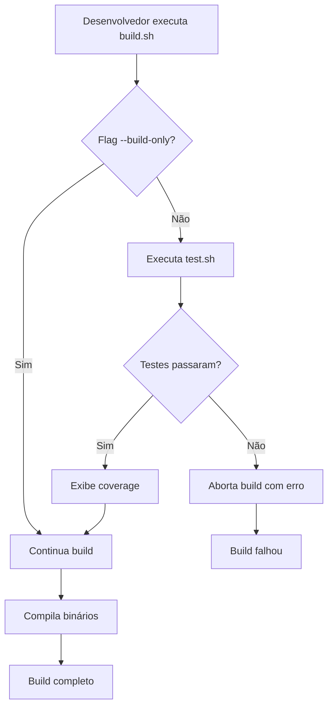

# Design - Sistema de Testes Unitários para Procspy

## Overview

Este documento descreve o design da implementação de uma suíte completa de testes unitários para o projeto Procspy. O sistema de testes será estruturado para cobrir todos os componentes Go do projeto, integrar-se ao processo de build existente, e fornecer documentação clara sobre o escopo e propósito de cada teste.

### Objetivos

1. **Cobertura Completa**: Criar testes para todos os arquivos `.go` com lógica testável
2. **Automação**: Integrar testes ao processo de build através de script dedicado
3. **Documentação**: Fornecer documentação clara sobre escopo e propósito dos testes
4. **Qualidade**: Seguir boas práticas de testes em Go
5. **Manutenibilidade**: Estruturar testes de forma clara e fácil de manter

## Architecture

### Estrutura de Diretórios

```
procspy/
├── internal/
│   └── procspy/
│       ├── client/
│       │   ├── client.go
│       │   └── client_test.go          # Novo
│       ├── server/
│       │   ├── server.go
│       │   └── server_test.go          # Novo
│       ├── watcher/
│       │   ├── watcher.go
│       │   └── watcher_test.go         # Novo
│       ├── handlers/
│       │   ├── command.go
│       │   ├── command_test.go         # Novo
│       │   ├── healthcheck.go
│       │   ├── healthcheck_test.go     # Novo
│       │   ├── match.go
│       │   ├── match_test.go           # Novo
│       │   ├── report.go
│       │   ├── report_test.go          # Novo
│       │   ├── target.go
│       │   ├── target_test.go          # Novo
│       │   ├── util.go
│       │   └── util_test.go            # Novo
│       ├── service/
│       │   ├── command.go
│       │   ├── command_test.go         # Novo
│       │   ├── match.go
│       │   ├── match_test.go           # Novo
│       │   ├── target.go
│       │   ├── target_test.go          # Novo
│       │   ├── user.go
│       │   └── user_test.go            # Novo
│       ├── storage/
│       │   ├── command.go
│       │   ├── command_test.go         # Novo
│       │   ├── dbconn.go
│       │   ├── dbconn_test.go          # Novo
│       │   ├── match.go
│       │   └── match_test.go           # Novo
│       ├── domain/
│       │   ├── command.go
│       │   ├── command_test.go         # Novo
│       │   ├── match.go
│       │   ├── match_test.go           # Novo
│       │   ├── target.go
│       │   └── target_test.go          # Novo
│       └── config/
│           ├── client.go
│           ├── client_test.go          # Novo
│           ├── server.go
│           ├── server_test.go          # Novo
│           ├── watcher.go
│           └── watcher_test.go         # Novo
├── test.sh                              # Novo - Script de execução
├── test.md                              # Novo - Documentação
└── build.sh                             # Modificado - Integração com testes
```

### Fluxo de Execução



## Components and Interfaces

### 1. Script test.sh

**Responsabilidade**: Executar todos os testes unitários e gerar relatórios

**Funcionalidades**:
- Executar `go test` em todos os pacotes
- Gerar relatório de coverage
- Exibir estatísticas de execução
- Retornar código de saída apropriado

**Estrutura**:
```bash
#!/bin/bash
# test.sh - Script de execução de testes unitários

set -e

# Cores para output
GREEN='\033[0;32m'
RED='\033[0;31m'
YELLOW='\033[1;33m'
NC='\033[0m'

# Configurações
COVERAGE_FILE="coverage.out"
COVERAGE_HTML="coverage.html"
TARGET_COVERAGE=99
MIN_COVERAGE=70

# Funções principais:
# - run_tests(): Executa go test em todos os pacotes
# - generate_coverage(): Gera relatório de coverage
# - check_coverage(): Verifica se coverage mínimo foi atingido
# - display_stats(): Exibe estatísticas de execução
# - display_package_coverage(): Exibe coverage detalhado por pacote
```

### 2. Arquivo test.md

**Responsabilidade**: Documentar escopo e propósito de cada arquivo de teste

**Estrutura**:
```markdown
# Documentação de Testes Unitários - Procspy

## Visão Geral
[Descrição geral da estratégia de testes]

## Cobertura de Testes

### Pacote: internal/procspy/client
#### Arquivo: client_test.go
- **Escopo**: Testes do componente Client
- **Funções Testadas**:
  - TestNewSpy: Valida criação de instância Spy
  - TestUpdateTargets: Valida busca de targets do servidor
  - TestRun: Valida ciclo de scan de processos
  - [...]

[Repetir para cada pacote]
```

### 3. Arquivos *_test.go

**Padrão de Nomenclatura**: `<arquivo>_test.go` para cada `<arquivo>.go`

**Estrutura Padrão**:
```go
package <pacote>

import (
    "testing"
    // Outras importações necessárias
)

// TestFunctionName testa a função FunctionName
// Valida: [descrição do que está sendo validado]
// Cenários: [lista de cenários testados]
func TestFunctionName(t *testing.T) {
    // Arrange: Preparação dos dados de teste
    
    // Act: Execução da função testada
    
    // Assert: Validação dos resultados
}

// TestFunctionName_ErrorCase testa casos de erro
// Valida: [descrição do comportamento esperado em erro]
func TestFunctionName_ErrorCase(t *testing.T) {
    // ...
}
```

## Data Models

### Estrutura de Teste

Cada arquivo de teste seguirá o padrão AAA (Arrange-Act-Assert):

```go
func TestExample(t *testing.T) {
    // Arrange: Preparação
    input := "test data"
    expected := "expected result"
    
    // Act: Execução
    result := FunctionUnderTest(input)
    
    // Assert: Validação
    if result != expected {
        t.Errorf("Expected %s, got %s", expected, result)
    }
}
```

### Table-Driven Tests

Para funções com múltiplos cenários:

```go
func TestMultipleScenarios(t *testing.T) {
    tests := []struct {
        name     string
        input    string
        expected string
        wantErr  bool
    }{
        {"caso válido", "input1", "output1", false},
        {"caso de erro", "invalid", "", true},
    }
    
    for _, tt := range tests {
        t.Run(tt.name, func(t *testing.T) {
            result, err := FunctionUnderTest(tt.input)
            
            if (err != nil) != tt.wantErr {
                t.Errorf("wantErr %v, got %v", tt.wantErr, err)
            }
            
            if result != tt.expected {
                t.Errorf("expected %s, got %s", tt.expected, result)
            }
        })
    }
}
```

## Error Handling

### Estratégias de Teste de Erros

1. **Validação de Erros Esperados**:
```go
func TestErrorCase(t *testing.T) {
    _, err := FunctionThatShouldFail()
    if err == nil {
        t.Error("Expected error, got nil")
    }
}
```

2. **Validação de Mensagens de Erro**:
```go
func TestErrorMessage(t *testing.T) {
    _, err := FunctionThatShouldFail()
    if err == nil || !strings.Contains(err.Error(), "expected message") {
        t.Errorf("Expected error message containing 'expected message', got %v", err)
    }
}
```

3. **Validação de Tipos de Erro**:
```go
func TestErrorType(t *testing.T) {
    _, err := FunctionThatShouldFail()
    if !errors.Is(err, ErrExpectedType) {
        t.Errorf("Expected ErrExpectedType, got %v", err)
    }
}
```

## Testing Strategy

### Níveis de Teste

#### 1. Testes de Unidade (Unit Tests)
- **Escopo**: Funções e métodos individuais
- **Isolamento**: Sem dependências externas (usar mocks)
- **Velocidade**: Rápidos (< 100ms por teste)

#### 2. Testes de Integração (Integration Tests)
- **Escopo**: Interação entre componentes
- **Isolamento**: Pode usar recursos reais (banco de dados em memória)
- **Velocidade**: Moderados (< 1s por teste)

### Estratégia por Componente

#### Domain Package
- **Foco**: Parsing JSON, validação de dados, lógica de negócio
- **Técnica**: Table-driven tests para múltiplos cenários
- **Mocks**: Não necessários (funções puras)

**Exemplo**:
```go
// domain/target_test.go
func TestTarget_Match(t *testing.T) {
    // Testa regex matching de processos
}

func TestTargetListFromJson(t *testing.T) {
    // Testa parsing de JSON válido e inválido
}
```

#### Config Package
- **Foco**: Parsing de configurações, validação, defaults
- **Técnica**: Testes com arquivos temporários
- **Mocks**: Não necessários

**Exemplo**:
```go
// config/client_test.go
func TestClientConfigFromJson(t *testing.T) {
    // Testa parsing de JSON de configuração
}

func TestClient_SetDefaults(t *testing.T) {
    // Testa aplicação de valores padrão
}
```

#### Storage Package
- **Foco**: Operações de banco de dados
- **Técnica**: Banco SQLite em memória (`:memory:`)
- **Mocks**: Não necessários (usar banco em memória)

**Exemplo**:
```go
// storage/match_test.go
func TestMatch_InsertMatch(t *testing.T) {
    // Usa banco em memória para testar insert
    conn := NewDbConnection(":memory:")
    // ...
}
```

#### Service Package
- **Foco**: Lógica de negócio, orquestração
- **Técnica**: Mocks para storage layer
- **Mocks**: Mock de storage

**Exemplo**:
```go
// service/match_test.go
type mockMatchStorage struct {
    insertCalled bool
}

func (m *mockMatchStorage) InsertMatch(match *domain.Match) error {
    m.insertCalled = true
    return nil
}
```

#### Handlers Package
- **Foco**: Endpoints HTTP, validação de requests
- **Técnica**: httptest.ResponseRecorder
- **Mocks**: Mock de services

**Exemplo**:
```go
// handlers/match_test.go
func TestMatch_InsertMatch(t *testing.T) {
    // Cria request HTTP de teste
    req := httptest.NewRequest("POST", "/match/user1", body)
    w := httptest.NewRecorder()
    
    // Executa handler
    handler.InsertMatch(w, req)
    
    // Valida response
    if w.Code != http.StatusCreated {
        t.Errorf("Expected 201, got %d", w.Code)
    }
}
```

#### Client Package
- **Foco**: Lógica de monitoramento, scan de processos
- **Técnica**: Mocks para HTTP client e process scanner
- **Mocks**: Mock de HTTP e processos

**Exemplo**:
```go
// client/client_test.go
func TestSpy_UpdateTargets(t *testing.T) {
    // Cria servidor HTTP de teste
    server := httptest.NewServer(handler)
    defer server.Close()
    
    // Testa busca de targets
}
```

#### Server Package
- **Foco**: Inicialização, roteamento
- **Técnica**: Testes de integração com servidor real
- **Mocks**: Mínimos

**Exemplo**:
```go
// server/server_test.go
func TestNewServer(t *testing.T) {
    // Testa criação de servidor
}
```

#### Watcher Package
- **Foco**: Health checks, recuperação
- **Técnica**: Mock de HTTP client
- **Mocks**: Mock de HTTP

**Exemplo**:
```go
// watcher/watcher_test.go
func TestWatcher_Check(t *testing.T) {
    // Testa verificação de health check
}
```

### Padrões de Mock

#### Interface-Based Mocking

```go
// Define interface
type MatchStorage interface {
    InsertMatch(match *domain.Match) error
    GetMatches(user string) (map[string]float64, error)
}

// Implementação mock
type mockMatchStorage struct {
    insertError error
    matches     map[string]float64
}

func (m *mockMatchStorage) InsertMatch(match *domain.Match) error {
    return m.insertError
}

func (m *mockMatchStorage) GetMatches(user string) (map[string]float64, error) {
    return m.matches, nil
}
```

#### HTTP Server Mocking

```go
func TestHTTPCall(t *testing.T) {
    // Cria servidor de teste
    server := httptest.NewServer(http.HandlerFunc(func(w http.ResponseWriter, r *http.Request) {
        w.WriteHeader(http.StatusOK)
        w.Write([]byte(`{"status":"ok"}`))
    }))
    defer server.Close()
    
    // Usa URL do servidor de teste
    result, err := httpGet(server.URL)
    // ...
}
```

### Coverage Goals

| Pacote | Coverage Alvo | Coverage Mínimo | Prioridade | Complexidade |
|--------|---------------|-----------------|------------|--------------|
| domain | 99% | 99% | Alta | Baixa |
| config | 99% | 99% | Alta | Baixa |
| storage | 99% | 95% | Alta | Média |
| service | 99% | 95% | Alta | Média |
| handlers | 99% | 90% | Alta | Média |
| client | 99% | 70% | Alta | Alta |
| server | 99% | 90% | Média | Média |
| watcher | 99% | 70% | Média | Alta |

**Nota**: O coverage mínimo de 70% é aceito apenas para componentes de alta complexidade (client e watcher) onde interações com sistema operacional e processos externos tornam 99% de cobertura impraticável. Todos os outros componentes devem atingir no mínimo 90%.

### Casos de Teste Essenciais

#### Para Cada Função Pública:
1. **Caso de Sucesso**: Validar comportamento esperado com inputs válidos
2. **Caso de Erro**: Validar tratamento de inputs inválidos
3. **Casos de Borda**: Validar comportamento em limites (nil, vazio, zero, etc)
4. **Casos de Valores Extremos**: Validar comportamento com valores máximos/mínimos
5. **Casos de Concorrência**: Validar comportamento em cenários paralelos quando aplicável
6. **Casos de Estado**: Validar todas as transições de estado possíveis

#### Para Handlers HTTP:
1. **Request Válido**: Validar response 200/201
2. **Request Inválido**: Validar response 400
3. **Erro Interno**: Validar response 500
4. **Validação de Usuário**: Validar response 401/403
5. **Métodos HTTP**: Validar todos os métodos suportados (GET, POST, etc)
6. **Headers**: Validar comportamento com diferentes headers
7. **Query Parameters**: Validar todos os parâmetros de query possíveis
8. **Path Parameters**: Validar extração e validação de parâmetros de path
9. **Body Vazio**: Validar comportamento com body vazio quando aplicável
10. **Content-Type**: Validar comportamento com diferentes content-types

#### Para Storage:
1. **Insert Sucesso**: Validar inserção de dados
2. **Insert Duplicado**: Validar tratamento de duplicatas
3. **Query Sucesso**: Validar busca de dados
4. **Query Vazio**: Validar busca sem resultados
5. **Update**: Validar atualização de registros existentes
6. **Delete**: Validar remoção de registros
7. **Transações**: Validar rollback em caso de erro
8. **Conexão Fechada**: Validar comportamento com conexão fechada
9. **Queries Complexas**: Validar joins, agregações, etc
10. **Índices**: Validar uso correto de índices

## Integration with Build System

### Modificações no build.sh

```bash
# Adicionar no início do script
TEST_ONLY=false
BUILD_ONLY=false

# Parse de argumentos
while [[ $# -gt 0 ]]; do
    case $1 in
        -t|--test-only)
            TEST_ONLY=true
            shift
            ;;
        -b|--build-only)
            BUILD_ONLY=true
            shift
            ;;
        # ... outros argumentos
    esac
done

# Executar testes se não for build-only
if [ "$BUILD_ONLY" = false ]; then
    if ! ./test.sh; then
        echo -e "${RED}Build abortado devido a falhas nos testes${NC}"
        exit 1
    fi
fi

# Se for test-only, para aqui
if [ "$TEST_ONLY" = true ]; then
    exit 0
fi

# Continua com build normal...
```

### Comandos de Uso

```bash
# Executar apenas testes
./build.sh --test-only

# Executar build sem testes
./build.sh --build-only

# Executar testes e build (padrão)
./build.sh

# Executar apenas script de testes
./test.sh
```

## Documentation Structure

### test.md Template

```markdown
# Documentação de Testes Unitários - Procspy

## Visão Geral

Este documento descreve o escopo e propósito de cada arquivo de teste no projeto Procspy.

### Estatísticas de Coverage

- **Coverage Total**: XX%
- **Pacotes Testados**: XX/XX
- **Testes Totais**: XXX

### Convenções

- Todos os testes seguem o padrão AAA (Arrange-Act-Assert)
- Testes de múltiplos cenários usam table-driven tests
- Comentários em português explicam o propósito de cada teste

## Cobertura de Testes por Pacote

### internal/procspy/domain

#### target_test.go
**Escopo**: Testes do modelo Target e operações relacionadas

**Funções Testadas**:
- `TestNewTargetList`: Valida criação de lista vazia de targets
- `TestTargetListFromJson`: Valida parsing de JSON para TargetList
  - Cenário: JSON válido
  - Cenário: JSON inválido
  - Cenário: JSON vazio
- `TestTarget_Match`: Valida matching de processos com regex
  - Cenário: Match exato
  - Cenário: Match parcial
  - Cenário: Sem match
- `TestTarget_AddElapsed`: Valida acumulação de tempo
- `TestTarget_CheckLimit`: Valida verificação de limite
- `TestTarget_CheckWarning`: Valida verificação de aviso

[Continuar para cada arquivo...]
```

## Estratégias para Atingir 99% de Coverage

### 1. Análise de Coverage Atual
- Executar `go test -coverprofile=coverage.out ./...`
- Gerar relatório HTML: `go tool cover -html=coverage.out`
- Identificar linhas não cobertas em cada arquivo
- Priorizar arquivos com coverage abaixo de 90%

### 2. Cobertura de Branches
- Garantir que todos os `if/else` sejam testados
- Testar todos os casos de `switch/case`
- Validar todos os retornos de erro possíveis
- Testar loops com 0, 1 e múltiplas iterações

### 3. Cobertura de Edge Cases
- Valores nil/zero/vazio
- Valores máximos e mínimos
- Strings vazias e muito longas
- Arrays/slices vazios e com múltiplos elementos
- Timeouts e cancelamentos de contexto

### 4. Cobertura de Código de Erro
- Simular falhas de I/O
- Simular falhas de rede
- Simular falhas de banco de dados
- Testar todos os caminhos de erro

### 5. Uso de Mocks Avançados
- Criar mocks que simulem diferentes estados
- Usar mocks para forçar erros específicos
- Implementar mocks com comportamento configurável

### 6. Testes de Integração Leves
- Usar bancos em memória para storage
- Usar httptest para handlers
- Evitar dependências externas reais

### 7. Análise Iterativa
- Executar coverage após cada novo teste
- Identificar gaps de cobertura
- Adicionar testes específicos para gaps
- Repetir até atingir meta

## Best Practices

### 1. Nomenclatura Clara
```go
// Bom
func TestTarget_Match_ValidPattern(t *testing.T)

// Ruim
func TestFunc1(t *testing.T)
```

### 2. Comentários Descritivos
```go
// TestTarget_Match valida o matching de processos com padrões regex
// Testa os seguintes cenários:
// - Match exato: processo corresponde exatamente ao pattern
// - Match parcial: processo contém o pattern
// - Sem match: processo não corresponde ao pattern
func TestTarget_Match(t *testing.T) {
    // ...
}
```

### 3. Isolamento de Testes
```go
// Cada teste deve ser independente
func TestFunction1(t *testing.T) {
    // Não depende de TestFunction2
}

func TestFunction2(t *testing.T) {
    // Não depende de TestFunction1
}
```

### 4. Cleanup Apropriado
```go
func TestWithResources(t *testing.T) {
    // Setup
    resource := createResource()
    defer resource.Close() // Cleanup garantido
    
    // Test
    // ...
}
```

### 5. Mensagens de Erro Úteis
```go
// Bom
t.Errorf("Expected elapsed time %.2f, got %.2f", expected, actual)

// Ruim
t.Error("Test failed")
```

### 6. Uso de Subtests
```go
func TestMultipleScenarios(t *testing.T) {
    t.Run("cenário 1", func(t *testing.T) {
        // Teste isolado
    })
    
    t.Run("cenário 2", func(t *testing.T) {
        // Teste isolado
    })
}
```

## Performance Considerations

### 1. Testes Rápidos
- Cada teste unitário deve executar em < 100ms
- Usar mocks para evitar I/O real
- Evitar sleep() em testes

### 2. Paralelização
```go
func TestParallel(t *testing.T) {
    t.Parallel() // Permite execução paralela
    // ...
}
```

### 3. Banco de Dados em Memória
```go
// Usar :memory: para testes de storage
conn := NewDbConnection(":memory:")
```

## Continuous Integration

### Execução Automática
- Testes devem ser executados em cada commit
- Build deve falhar se testes falharem
- Coverage deve ser reportado

### Métricas
- Coverage alvo: 99%
- Coverage mínimo aceitável: 70% (apenas para componentes de alta complexidade)
- Coverage mínimo para componentes simples: 90%
- Todos os testes devem passar
- Tempo total de execução: < 60s
- Relatório detalhado de coverage por pacote deve ser gerado

## Maintenance

### Adicionando Novos Testes
1. Criar arquivo `*_test.go` no mesmo pacote
2. Seguir padrões estabelecidos
3. Adicionar comentários descritivos
4. Atualizar test.md com novo escopo
5. Executar `./test.sh` para validar

### Atualizando Testes Existentes
1. Manter compatibilidade com testes existentes
2. Adicionar novos cenários quando necessário
3. Atualizar comentários se comportamento mudar
4. Atualizar test.md se escopo mudar

### Debugging de Testes
```bash
# Executar teste específico
go test -v -run TestFunctionName ./internal/procspy/domain

# Executar com coverage detalhado
go test -v -coverprofile=coverage.out ./...
go tool cover -html=coverage.out

# Executar com race detector
go test -race ./...
```
