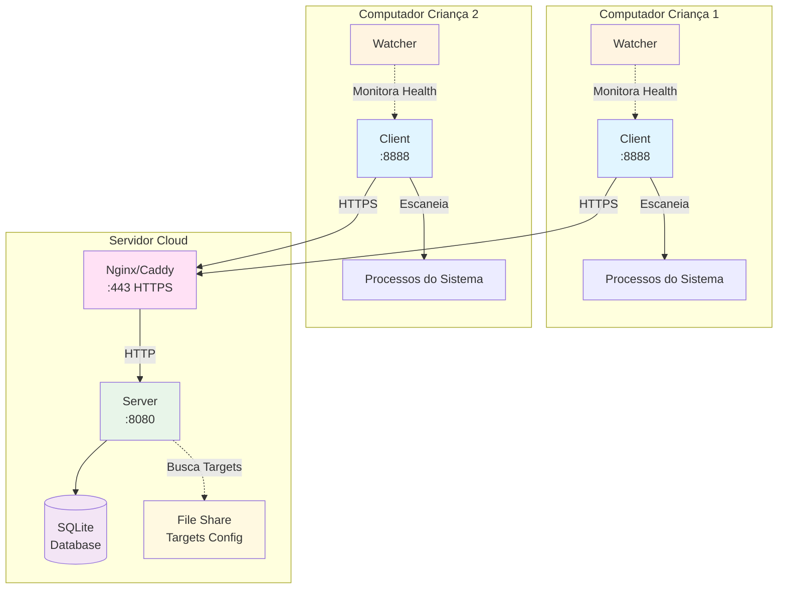
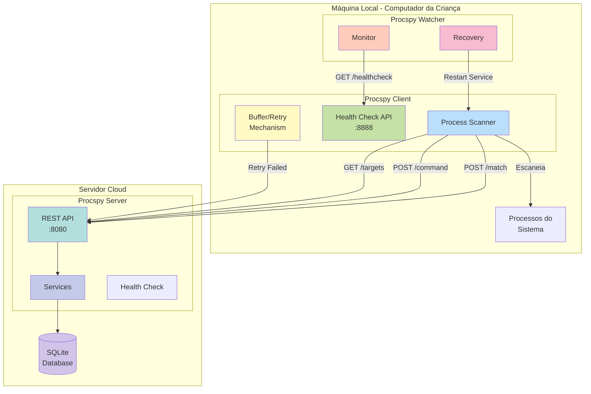
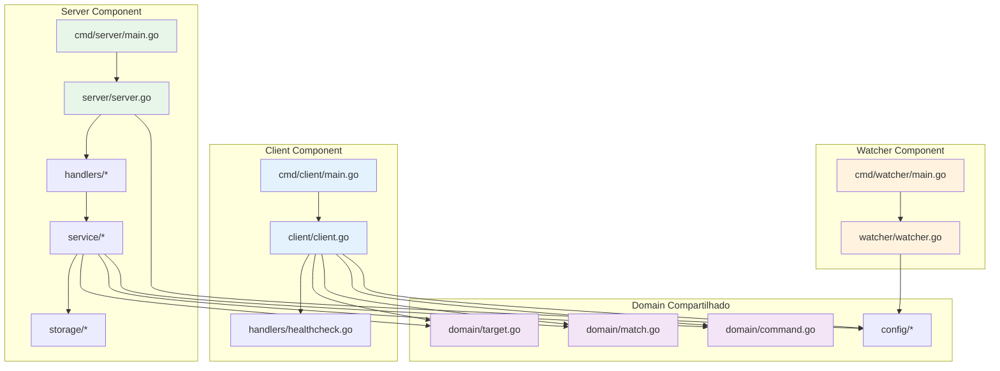
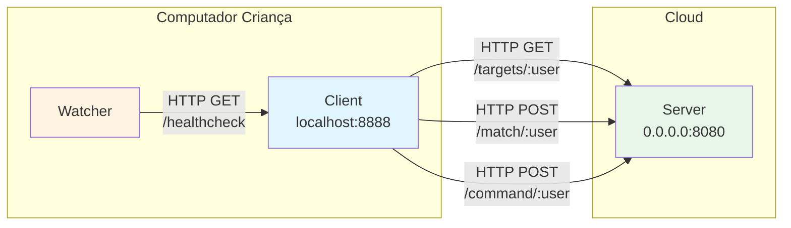
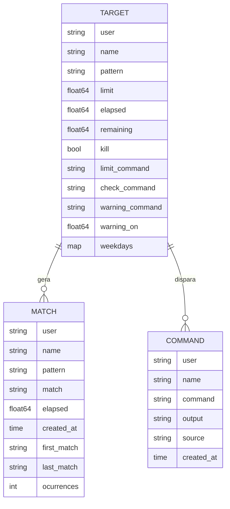
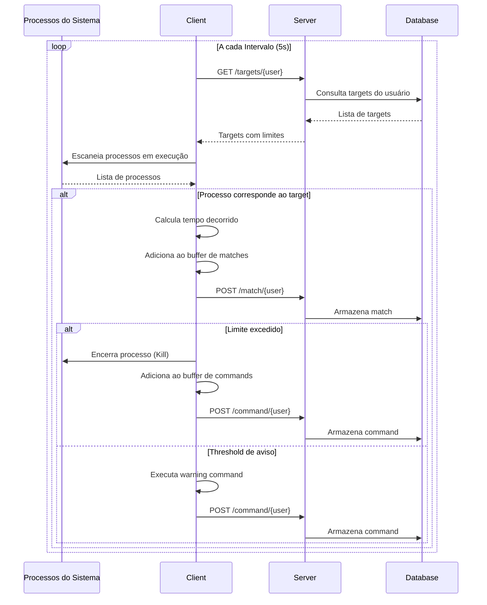
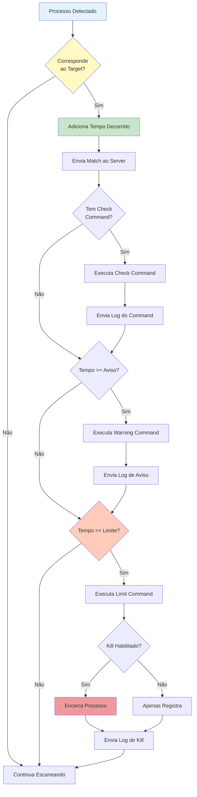
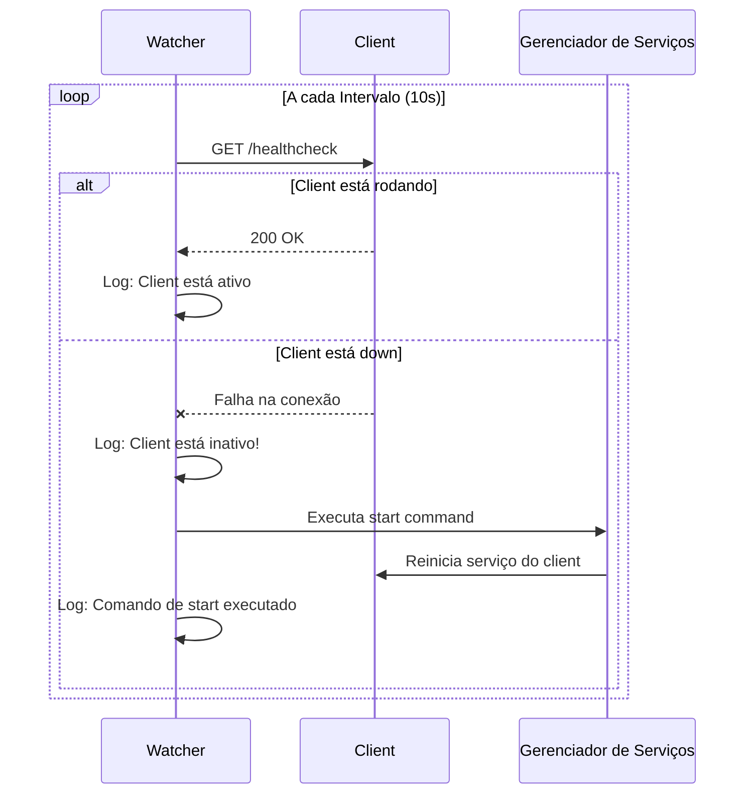

# Procspy


Sistema distribuído de monitoramento e controle parental desenvolvido em Go para gerenciar o tempo de uso de aplicações em computadores.

---

## 📑 Índice

- [Visão Geral](#-visão-geral)
- [Características e Capacidades](#-características-e-capacidades)
- [Arquitetura do Sistema](#-arquitetura-do-sistema)
- [Componentes Detalhados](#-componentes-detalhados)
- [Modelos de Dados](#-modelos-de-dados)
- [API REST](#-api-rest)
- [Fluxos Operacionais](#-fluxos-operacionais)
- [Suporte Cross-Platform](#-suporte-cross-platform)
- [Configuração](#-configuração)
- [Instalação e Deployment](#-instalação-e-deployment)
- [Operação e Monitoramento](#-operação-e-monitoramento)
- [Estrutura do Projeto](#-estrutura-do-projeto)
- [Segurança](#-segurança)
- [FAQ](#-faq)

---

## 🎯 Visão Geral

### Propósito do Sistema

O **Procspy** é um sistema de controle parental projetado para ajudar pais a monitorar e controlar o tempo que seus filhos passam em aplicações específicas no computador. O sistema detecta automaticamente quando programas como jogos, navegadores e players de vídeo estão em execução, calcula o tempo acumulado de uso e aplica limites configuráveis, podendo até mesmo encerrar os processos quando o tempo limite é atingido.

### Problema que Resolve

Crianças e adolescentes podem facilmente perder a noção do tempo ao usar computadores, especialmente com jogos e entretenimento online. O Procspy oferece uma solução automatizada que:

- **Monitora continuamente** processos em execução
- **Calcula tempo acumulado** de uso por aplicação
- **Aplica limites configuráveis** por dia da semana
- **Envia avisos** quando o tempo está próximo do limite
- **Encerra automaticamente** aplicações que excedem o limite
- **Protege contra desativação** através do componente Watcher
- **Centraliza telemetria** em servidor cloud para múltiplos computadores

### Componentes Principais

O sistema é composto por três componentes que trabalham em conjunto:

#### 1. **Client (Procspy-Client)**
- **Localização**: Instalado nos computadores das crianças
- **Função**: Monitora processos localmente e aplica limites
- **Execução**: Como serviço do sistema operacional
- **Plataformas**: Windows, Linux, macOS

#### 2. **Server (Procspy-Server)**
- **Localização**: Hospedado em servidor cloud (VPS, AWS, etc)
- **Função**: Centraliza telemetria, armazena métricas e fornece configurações
- **Execução**: Como serviço Linux (systemd)
- **Plataformas**: Linux

#### 3. **Watcher (Procspy-Watcher)**
- **Localização**: Instalado nos computadores das crianças
- **Função**: Garante que o Client não seja fechado pelas crianças
- **Execução**: Como serviço do sistema operacional
- **Plataformas**: Windows, Linux, macOS

### Diagrama de Arquitetura de Alto Nível



### Como Funciona

1. **Client** escaneia processos em execução a cada intervalo configurado (ex: 5 segundos)
2. **Client** compara processos com padrões regex configurados (ex: `chrome|firefox|steam`)
3. Quando há match, **Client** acumula tempo de uso e envia dados ao **Server**
4. **Server** armazena telemetria no banco SQLite
5. Quando limite é atingido, **Client** encerra o processo automaticamente
6. **Watcher** verifica periodicamente se **Client** está rodando
7. Se **Client** for fechado, **Watcher** reinicia o serviço automaticamente

---

## ✨ Características e Capacidades

### Funcionalidades Principais

- ✅ **Monitoramento em Tempo Real**: Escaneia processos continuamente
- ✅ **Pattern Matching Flexível**: Usa regex para identificar aplicações
- ✅ **Limites Configuráveis por Dia**: Diferentes limites para dias de semana e fins de semana
- ✅ **Sistema de Avisos Progressivos**: Notifica antes de atingir o limite
- ✅ **Terminação Automática**: Encerra processos que excedem o limite
- ✅ **Proteção contra Desativação**: Watcher reinicia Client automaticamente
- ✅ **Telemetria Centralizada**: Dados de múltiplos computadores em um servidor
- ✅ **Relatórios de Uso**: Consulta histórico de uso por usuário
- ✅ **Buffer e Retry**: Garante envio de dados mesmo com falhas de rede
- ✅ **Logs Rotativos**: Mantém histórico de 30 dias automaticamente
- ✅ **Health Checks**: Endpoints para monitoramento de saúde

### Suporte Cross-Platform

- 🪟 **Windows**: 7, 8, 10, 11, Server
- 🐧 **Linux**: Ubuntu, Debian, CentOS, RHEL, Fedora
- 🍎 **macOS**: 10.12 ou superior

### Diferenciais

- **Proteção Dupla**: Client + Watcher garantem monitoramento contínuo
- **Flexibilidade**: Limites diferentes por dia da semana
- **Escalabilidade**: Um servidor pode gerenciar múltiplos computadores
- **Comandos Customizáveis**: Execute scripts personalizados em avisos e limites
- **Resiliência**: Sistema de retry garante que dados não sejam perdidos

### Casos de Uso

1. **Controle de Jogos**: Limitar tempo em Steam, Roblox, Minecraft
2. **Gestão de Navegação**: Controlar uso de Chrome, Firefox, Edge
3. **Tempo de Tela Total**: Monitorar tempo total no computador
4. **Players de Vídeo**: Limitar uso de VLC, Media Player
5. **Múltiplas Crianças**: Gerenciar vários computadores de um único servidor

---

## 🏗️ Arquitetura do Sistema

### Diagrama de Deployment



### Diagrama de Componentes Internos



### Comunicação entre Componentes

O sistema utiliza **HTTP/REST** para comunicação entre componentes:

#### Client → Server
- `GET /targets/:user` - Busca configurações de targets
- `POST /match/:user` - Envia detecção de processo
- `POST /command/:user` - Envia log de comando executado
- `GET /healthcheck` - Verifica saúde do servidor

#### Watcher → Client
- `GET /healthcheck` - Verifica se Client está rodando

### Fluxo de Dados

1. **Configuração**: Server fornece lista de targets para Client
2. **Detecção**: Client escaneia processos e identifica matches
3. **Registro**: Client envia matches para Server via POST
4. **Armazenamento**: Server persiste dados no SQLite
5. **Ação**: Client executa comandos (avisos, limites, kill)
6. **Log**: Client envia logs de comandos para Server
7. **Retry**: Em caso de falha, dados ficam em buffer para retry

### Diagrama de Comunicação de Rede



---

## 🔧 Componentes Detalhados

### Client Component (Procspy-Client)

#### Função e Responsabilidades

O Client é o componente principal instalado nos computadores das crianças. Ele é responsável por:
- Escanear processos em execução periodicamente
- Identificar processos que correspondem aos padrões configurados
- Calcular tempo acumulado de uso
- Aplicar limites e encerrar processos quando necessário
- Enviar telemetria para o Server
- Executar comandos personalizados (avisos, limites)

#### Tecnologias Utilizadas

- **Go 1.24+**: Linguagem de programação
- **gin-gonic/gin**: Framework HTTP para API REST
- **mitchellh/go-ps**: Biblioteca para listar processos do sistema
- **modernc.org/sqlite**: Driver SQLite (usado pelo Server)
- **lestrrat/go-file-rotatelogs**: Rotação automática de logs

#### Funcionalidades Detalhadas

**1. Scan de Processos**
- Executa a cada intervalo configurado (padrão: 5 segundos)
- Usa `ps.Processes()` para listar todos os processos
- Compara nome do executável com patterns regex

**2. Pattern Matching**
- Suporta regex complexas: `chrome|firefox|opera`
- Case-insensitive por padrão
- Compila regex uma vez para performance

**3. Cálculo de Tempo**
- Acumula tempo desde o último scan
- Armazena elapsed time por target
- Calcula remaining time baseado no limite

**4. Sistema de Limites**
- Limites diferentes por dia da semana
- Formato: `{"0": 2.0, "1": 0.5}` (domingo: 2h, segunda: 0.5h)
- Base de 60 minutos * 60 segundos = 3600 segundos/hora

**5. Terminação de Processos**
- Usa `os.FindProcess()` e `Process.Kill()`
- Funciona cross-platform (Windows, Linux, macOS)
- Registra cada kill no Server

**6. Buffer e Retry**
- Mantém buffers de matches e commands
- Retry automático em caso de falha de rede
- DLQ (Dead Letter Queue) para falhas persistentes

**7. Health Check**
- Endpoint HTTP em `localhost:8888/healthcheck`
- Usado pelo Watcher para monitoramento
- Retorna status 200 OK quando saudável

#### Exemplo de Log

```
2024-11-12 14:30:15 [run]  > [games] Found 2 processes: [1234, 5678]
2024-11-12 14:30:15 [run]  > [games] Match process with pattern roblox|steam -> [steam.exe, roblox.exe]
2024-11-12 14:30:15 [run]  > [games] Add 5.00s -> Use 3605.00 from 3600.00s
2024-11-12 14:30:15 [run]  >> [games] Exceeded limit of 3600.00 seconds
2024-11-12 14:30:15 [run]  >> [games] Killing processes: [1234, 5678]
```

---

### Server Component (Procspy-Server)

#### Função e Responsabilidades

O Server é o centralizador de telemetria hospedado em cloud. Ele é responsável por:
- Receber dados de múltiplos Clients
- Armazenar matches e commands no SQLite
- Fornecer configurações de targets por usuário
- Gerar relatórios de uso
- Expor API REST para comunicação

#### Tecnologias Utilizadas

- **Go 1.24+**: Linguagem de programação
- **gin-gonic/gin**: Framework HTTP para API REST
- **modernc.org/sqlite**: Driver SQLite puro Go
- **lestrrat/go-file-rotatelogs**: Rotação automática de logs

#### Funcionalidades Detalhadas

**1. API REST**
- Endpoints para receber matches e commands
- Endpoint para fornecer targets
- Endpoint para gerar relatórios
- Health check endpoint

**2. Armazenamento SQLite**
- Banco de dados embutido (sem servidor externo)
- Tabelas: matches, commands
- Índices para queries rápidas
- Localização configurável (padrão: `./data/`)

**3. Gerenciamento de Targets**
- Busca configurações de URLs externas
- Suporta múltiplos usuários
- Cache de targets em memória
- Atualização sob demanda

**4. Sistema de Relatórios**
- Agregação de dados por usuário
- Filtros por data e target
- Cálculo de totais e médias
- Formato JSON para fácil integração

#### Exemplo de Log

```
2024-11-12 14:30:20 [POST] /match/fino - 201 Created
2024-11-12 14:30:20 [InsertMatch] Match inserted: user=fino, name=games, elapsed=5.00s
2024-11-12 14:30:25 [POST] /command/fino - 201 Created
2024-11-12 14:30:25 [InsertCommand] Command logged: user=fino, name=games, source=Limit
```

---

### Watcher Component (Procspy-Watcher)

#### Função e Responsabilidades

O Watcher é o componente de proteção que garante que o Client não seja desativado. Ele é responsável por:
- Verificar periodicamente se o Client está rodando
- Detectar quando o Client está down
- Executar comando de restart automaticamente
- Registrar status em logs

#### Tecnologias Utilizadas

- **Go 1.24+**: Linguagem de programação
- **net/http**: Cliente HTTP para health checks
- **os/exec**: Execução de comandos do sistema
- **lestrrat/go-file-rotatelogs**: Rotação automática de logs

#### Funcionalidades Detalhadas

**1. Monitoramento Periódico**
- Verifica health check a cada intervalo (padrão: 10 segundos)
- Faz GET request para `http://localhost:8888/healthcheck`
- Timeout configurável

**2. Detecção de Falha**
- Identifica quando Client não responde
- Distingue entre timeout e erro de conexão
- Registra tipo de falha em logs

**3. Recuperação Automática**
- Executa comando configurado em `start_cmd`
- Suporta comandos específicos por OS
- Aguarda próximo ciclo para verificar recuperação

**4. Comandos de Restart**

Windows (NSSM):
```json
{
  "start_cmd": "nssm restart procspy-client"
}
```

Linux (systemctl):
```json
{
  "start_cmd": "systemctl restart procspy-client"
}
```

#### Exemplo de Log

```
2024-11-12 14:35:00 [check] Procspy is up! Status: 200, Response: {"status":"ok"}
2024-11-12 14:35:10 [check] Procspy is down! Status: 0, Error: connection refused
2024-11-12 14:35:10 [executeCommand] Executing command: systemctl restart procspy-client
2024-11-12 14:35:10 [check] Start command executed successfully
2024-11-12 14:35:20 [check] Procspy is up! Status: 200, Response: {"status":"ok"}
```

---

## 📊 Modelos de Dados

### Target (Alvo de Monitoramento)

Representa uma aplicação ou grupo de aplicações a serem monitoradas.

#### Campos

| Campo | Tipo | Descrição |
|-------|------|-----------|
| `user` | string | Identificador do usuário (criança) |
| `name` | string | Nome descritivo do target (ex: "games", "browsers") |
| `pattern` | string | Regex para matching de processos |
| `source` | string | Origem da configuração (opcional) |
| `limit` | float64 | Limite de tempo em segundos (calculado) |
| `elapsed` | float64 | Tempo acumulado em segundos |
| `remaining` | float64 | Tempo restante em segundos |
| `ocurrences` | int | Número de detecções |
| `first_match` | string | Timestamp da primeira detecção |
| `last_match` | string | Timestamp da última detecção |
| `kill` | bool | Se deve encerrar processo ao atingir limite |
| `limit_command` | string | Comando a executar ao atingir limite |
| `check_command` | string | Comando a executar periodicamente |
| `warning_command` | string | Comando a executar no aviso |
| `warning_on` | float64 | Threshold de aviso (95% do limite) |
| `weekdays` | map[int]float64 | Multiplicadores por dia da semana |

#### Exemplo JSON

```json
{
  "user": "fino",
  "name": "games",
  "pattern": "roblox|steam|wine|cs\\.exe|hl\\.exe",
  "limit": 3600.0,
  "elapsed": 1800.0,
  "remaining": 1800.0,
  "kill": true,
  "limit_command": "notify-send 'Tempo esgotado!'",
  "warning_command": "notify-send 'Faltam 5 minutos!'",
  "weekdays": {
    "0": 2.0,
    "1": 0.5,
    "2": 0.5,
    "3": 0.5,
    "4": 0.5,
    "5": 0.5,
    "6": 2.0
  }
}
```

#### Sistema de Limites por Dia da Semana

- **Chave**: Dia da semana (0=Domingo, 1=Segunda, ..., 6=Sábado)
- **Valor**: Multiplicador de horas
- **Cálculo**: `limit = 3600 * multiplicador`
- **Exemplo**: `"1": 0.5` = 0.5 horas = 30 minutos na segunda-feira

---

### Match (Detecção de Processo)

Representa uma detecção de processo durante um scan.

#### Campos

| Campo | Tipo | Descrição |
|-------|------|-----------|
| `user` | string | Identificador do usuário |
| `name` | string | Nome do target |
| `pattern` | string | Pattern que fez o match |
| `match` | string | Nome(s) do(s) processo(s) detectado(s) |
| `elapsed` | float64 | Tempo decorrido desde último scan |
| `created_at` | time.Time | Timestamp da detecção |
| `first_match` | string | Primeira detecção do dia |
| `last_match` | string | Última detecção |
| `ocurrences` | int | Número de ocorrências |

#### Exemplo JSON

```json
{
  "user": "fino",
  "name": "games",
  "pattern": "roblox|steam",
  "match": "steam.exe / roblox.exe",
  "elapsed": 5.0,
  "created_at": "2024-11-12T14:30:15Z"
}
```

---

### Command (Registro de Comando)

Representa a execução de um comando automático.

#### Campos

| Campo | Tipo | Descrição |
|-------|------|-----------|
| `user` | string | Identificador do usuário |
| `name` | string | Nome do target |
| `command` | string | Comando executado |
| `output` | string | Saída do comando |
| `source` | string | Origem: "Check", "Warning", "Limit", "Kill" |
| `created_at` | time.Time | Timestamp da execução |

#### Exemplo JSON

```json
{
  "user": "fino",
  "name": "games",
  "command": "notify-send 'Tempo esgotado!'",
  "output": "Command executed successfully",
  "source": "Limit",
  "created_at": "2024-11-12T14:30:15Z"
}
```

---

### Diagrama de Entidades



### Schema SQLite

#### Tabela: matches

```sql
CREATE TABLE matches (
    id INTEGER PRIMARY KEY AUTOINCREMENT,
    user TEXT NOT NULL,
    name TEXT NOT NULL,
    pattern TEXT NOT NULL,
    match TEXT NOT NULL,
    elapsed REAL NOT NULL,
    created_at DATETIME DEFAULT CURRENT_TIMESTAMP,
    INDEX idx_user_name (user, name),
    INDEX idx_created_at (created_at)
);
```

#### Tabela: commands

```sql
CREATE TABLE commands (
    id INTEGER PRIMARY KEY AUTOINCREMENT,
    user TEXT NOT NULL,
    name TEXT NOT NULL,
    command TEXT NOT NULL,
    output TEXT,
    source TEXT NOT NULL,
    created_at DATETIME DEFAULT CURRENT_TIMESTAMP,
    INDEX idx_user_name (user, name),
    INDEX idx_source (source),
    INDEX idx_created_at (created_at)
);
```

---

## 🌐 API REST

### Endpoints do Server

#### GET /targets/:user

Retorna a lista de targets configurados para um usuário.

**Parâmetros:**
- `user` (path): Identificador do usuário

**Response:** 200 OK
```json
{
  "targets": [
    {
      "name": "games",
      "pattern": "roblox|steam",
      "limit": 3600.0,
      "kill": true,
      "weekdays": {
        "0": 2.0,
        "6": 2.0
      }
    }
  ]
}
```

**Exemplo:**
```bash
curl http://localhost:8080/targets/fino
```

---

#### POST /match/:user

Registra uma detecção de processo.

**Parâmetros:**
- `user` (path): Identificador do usuário

**Body:**
```json
{
  "user": "fino",
  "name": "games",
  "pattern": "steam",
  "match": "steam.exe",
  "elapsed": 5.0
}
```

**Response:** 201 Created
```json
{
  "status": "created",
  "id": 12345
}
```

**Exemplo:**
```bash
curl -X POST http://localhost:8080/match/fino \
  -H "Content-Type: application/json" \
  -d '{"user":"fino","name":"games","pattern":"steam","match":"steam.exe","elapsed":5.0}'
```

---

#### POST /command/:user

Registra a execução de um comando.

**Parâmetros:**
- `user` (path): Identificador do usuário

**Body:**
```json
{
  "user": "fino",
  "name": "games",
  "command": "notify-send 'Limite atingido'",
  "output": "Success",
  "source": "Limit"
}
```

**Response:** 201 Created
```json
{
  "status": "created",
  "id": 67890
}
```

**Exemplo:**
```bash
curl -X POST http://localhost:8080/command/fino \
  -H "Content-Type: application/json" \
  -d '{"user":"fino","name":"games","command":"notify-send","output":"Success","source":"Limit"}'
```

---

#### GET /report/:user

Retorna relatório de uso para um usuário.

**Parâmetros:**
- `user` (path): Identificador do usuário
- `date` (query, opcional): Data no formato YYYY-MM-DD
- `target` (query, opcional): Nome do target específico

**Response:** 200 OK
```json
{
  "user": "fino",
  "date": "2024-11-12",
  "targets": [
    {
      "name": "games",
      "total_time": 3605.0,
      "limit": 3600.0,
      "exceeded": true,
      "kills": 2
    }
  ]
}
```

**Exemplo:**
```bash
curl "http://localhost:8080/report/fino?date=2024-11-12"
```

---

#### GET /healthcheck

Verifica a saúde do serviço.

**Response:** 200 OK
```json
{
  "status": "ok",
  "timestamp": "2024-11-12T14:30:15Z"
}
```

**Exemplo:**
```bash
curl http://localhost:8080/healthcheck
```

---

## 🔄 Fluxos Operacionais

### Ciclo de Monitoramento do Client



### Fluxo de Aplicação de Limites



### Sistema de Avisos

O sistema possui três níveis de ação:

#### 1. Check Command (Verificação Periódica)
- **Quando**: A cada ciclo de scan, se configurado
- **Propósito**: Executar verificações ou notificações regulares
- **Exemplo**: `echo "Monitorando..." >> /tmp/procspy.log`

#### 2. Warning Command (Aviso)
- **Quando**: Ao atingir 95% do limite (configurável via `warning_on`)
- **Propósito**: Alertar o usuário que o tempo está acabando
- **Exemplo**: `notify-send "Atenção" "Faltam 5 minutos!"`

#### 3. Limit Command (Limite Atingido)
- **Quando**: Ao atingir 100% do limite
- **Propósito**: Notificar que o limite foi atingido
- **Exemplo**: `notify-send "Tempo Esgotado" "O tempo de uso acabou!"`

#### 4. Kill (Encerramento)
- **Quando**: Ao atingir 100% do limite e `kill: true`
- **Propósito**: Forçar encerramento da aplicação
- **Ação**: `os.FindProcess(pid).Kill()`

### Recuperação pelo Watcher



### Mecanismo de Buffer e Retry

O Client implementa um sistema robusto de buffer e retry para garantir que dados não sejam perdidos em caso de falhas de rede:

#### Funcionamento

1. **Buffers em Memória**
   - `matchBuf`: Canal com capacidade para 1000 matches
   - `commandBuf`: Canal com capacidade para 1000 commands

2. **Tentativa de Envio**
   - A cada ciclo, tenta enviar todos os itens dos buffers
   - Se envio falhar, item vai para DLQ (Dead Letter Queue)

3. **Dead Letter Queue (DLQ)**
   - Armazena temporariamente itens que falharam
   - Reinsere no buffer principal para nova tentativa
   - Evita perda de dados durante instabilidades

4. **Retry Automático**
   - Próximo ciclo tenta novamente
   - Continua até sucesso ou até buffer encher
   - Logs registram tentativas e falhas

#### Exemplo de Log

```
[consumeBuffers] 15 matches in buffer
[postMatch] Error posting match, http status code: 500 to http://server/match/fino
[consumeBuffers] Add match to post dlq: {"user":"fino","name":"games",...}
[consumeBuffers] 3 commands in buffer
[postCommand] Command POST return: {"status":"created"}
```

---

## 💻 Suporte Cross-Platform

### Plataformas Suportadas

O Procspy foi desenvolvido em Go, garantindo compatibilidade nativa com múltiplos sistemas operacionais:

| Sistema Operacional | Versões Suportadas | Status |
|---------------------|-------------------|--------|
| **Windows** | 7, 8, 10, 11, Server 2012+ | ✅ Testado |
| **Linux** | Ubuntu, Debian, CentOS, RHEL, Fedora | ✅ Testado |
| **macOS** | 10.12 (Sierra) ou superior | ✅ Compatível |

### Process Killing Cross-Platform

O encerramento de processos funciona de forma nativa em todos os sistemas operacionais:

#### Implementação em Go

```go
// Busca o processo pelo PID
process, err := os.FindProcess(pid)
if err != nil {
    log.Printf("Process %d not found: %s", pid, err)
    return
}

// Encerra o processo
err = process.Kill()
if err != nil {
    log.Printf("Error killing process %d: %s", pid, err)
}
```

#### Como Funciona por Sistema

**Windows:**
- Usa `TerminateProcess` via syscall
- Requer privilégios administrativos para alguns processos
- Funciona com processos .exe e aplicações UWP

**Linux:**
- Usa `SIGKILL` (signal 9) via syscall
- Requer permissões adequadas (root ou mesmo usuário)
- Funciona com qualquer processo

**macOS:**
- Usa `SIGKILL` via syscall (similar ao Linux)
- Requer permissões adequadas
- Funciona com aplicações .app e processos

### Serviços do Sistema

Para garantir execução contínua, os componentes devem rodar como serviços do sistema operacional:

#### Windows - NSSM (Non-Sucking Service Manager)

**O que é NSSM:**
- Ferramenta gratuita para criar serviços Windows
- Permite executar qualquer executável como serviço
- Gerencia restart automático e logging
- Download: https://nssm.cc/

**Comandos Principais:**
```powershell
# Instalar serviço
nssm install procspy-client "C:\Program Files\Procspy\procspy-client.exe" "C:\Program Files\Procspy\config-client.json"

# Configurar restart automático
nssm set procspy-client AppRestartDelay 5000

# Iniciar serviço
nssm start procspy-client

# Verificar status
nssm status procspy-client

# Parar serviço
nssm stop procspy-client

# Remover serviço
nssm remove procspy-client confirm
```

#### Linux - systemd/systemctl

**O que é systemd:**
- Sistema de inicialização padrão em distribuições modernas
- Gerencia serviços, sockets, dispositivos
- Suporta restart automático e dependências
- Integrado com journald para logs

**Comandos Principais:**
```bash
# Recarregar configurações
sudo systemctl daemon-reload

# Habilitar serviço (auto-start no boot)
sudo systemctl enable procspy-client

# Iniciar serviço
sudo systemctl start procspy-client

# Verificar status
sudo systemctl status procspy-client

# Ver logs
sudo journalctl -u procspy-client -f

# Parar serviço
sudo systemctl stop procspy-client

# Reiniciar serviço
sudo systemctl restart procspy-client

# Desabilitar auto-start
sudo systemctl disable procspy-client
```

#### macOS - launchd (Opcional)

**O que é launchd:**
- Sistema de inicialização do macOS
- Similar ao systemd do Linux
- Usa arquivos .plist para configuração
- Localização: `/Library/LaunchDaemons/`

**Comandos Principais:**
```bash
# Carregar serviço
sudo launchctl load /Library/LaunchDaemons/com.procspy.client.plist

# Descarregar serviço
sudo launchctl unload /Library/LaunchDaemons/com.procspy.client.plist

# Verificar status
sudo launchctl list | grep procspy
```

---

## ⚙️ Configuração

### Configuração do Client

Arquivo: `config-client.json`

```json
{
    "user": "nome_crianca",
    "log_path": "logs",
    "debug": false,
    "interval": 5,
    "server_url": "https://seu-servidor.com/procspy",
    "api_host": "localhost",
    "api_port": 8888
}
```

#### Parâmetros

| Parâmetro | Tipo | Descrição | Padrão |
|-----------|------|-----------|--------|
| `user` | string | Identificador único da criança | **obrigatório** |
| `log_path` | string | Diretório para armazenar logs | `"logs"` |
| `debug` | bool | Ativa modo debug com logs detalhados | `false` |
| `interval` | int | Intervalo entre scans em segundos | `5` |
| `server_url` | string | URL base do servidor (sem barra final) | **obrigatório** |
| `api_host` | string | Host para API do health check | `"localhost"` |
| `api_port` | int | Porta para API do health check | `8888` |

#### Valores Recomendados

- **interval**: 5-10 segundos (menor = mais preciso, maior = menos recursos)
- **debug**: `false` em produção, `true` para troubleshooting
- **api_port**: Usar porta alta (>1024) para evitar conflitos

---

### Configuração do Server

Arquivo: `config-server.json`

```json
{
    "debug": false,
    "log_path": "logs",
    "db_path": "data",
    "api_port": 8080,
    "api_host": "0.0.0.0",
    "user_targets": {
        "crianca1": "https://seu-servidor.com/targets/crianca1.json",
        "crianca2": "https://seu-servidor.com/targets/crianca2.json"
    }
}
```

#### Parâmetros

| Parâmetro | Tipo | Descrição | Padrão |
|-----------|------|-----------|--------|
| `debug` | bool | Ativa modo debug com logs detalhados | `false` |
| `log_path` | string | Diretório para armazenar logs | `"logs"` |
| `db_path` | string | Diretório para banco SQLite | `"data"` |
| `api_port` | int | Porta para API REST | `8080` |
| `api_host` | string | Host para bind (0.0.0.0 = todas interfaces) | `"0.0.0.0"` |
| `user_targets` | map | Mapa de usuário -> URL de targets | **obrigatório** |

#### user_targets

Mapeia cada usuário (criança) para uma URL contendo suas configurações de targets. Isso permite:
- Gerenciar configurações centralizadamente
- Atualizar targets sem reiniciar o Client
- Diferentes configurações por criança

**Exemplo de URL:**
```
https://seu-servidor.com/drive/api/public/dl/ABC123/procspy-crianca1.targets
```

---

### Configuração do Watcher

Arquivo: `watcher-config.json`

```json
{
    "log_path": "logs",
    "interval": 10,
    "procspy_url": "http://localhost:8888/healthcheck",
    "start_cmd": "systemctl restart procspy-client"
}
```

#### Parâmetros

| Parâmetro | Tipo | Descrição | Padrão |
|-----------|------|-----------|--------|
| `log_path` | string | Diretório para armazenar logs | `"logs"` |
| `interval` | int | Intervalo entre verificações em segundos | `10` |
| `procspy_url` | string | URL do health check do Client | **obrigatório** |
| `start_cmd` | string | Comando para reiniciar o Client | **obrigatório** |

#### start_cmd por Sistema Operacional

**Windows (NSSM):**
```json
{
    "start_cmd": "nssm restart procspy-client"
}
```

**Linux (systemctl):**
```json
{
    "start_cmd": "systemctl restart procspy-client"
}
```

**Windows (PowerShell alternativo):**
```json
{
    "start_cmd": "powershell -Command \"Restart-Service procspy-client\""
}
```

**Linux (service alternativo):**
```json
{
    "start_cmd": "service procspy-client restart"
}
```

---

### Configuração de Targets

Arquivo: `user-targets.json` (hospedado em URL acessível)

```json
{
    "targets": [
        {
            "name": "games",
            "pattern": "roblox|steam|wine|cs\\.exe|hl\\.exe",
            "kill": true,
            "limit_command": "notify-send 'Tempo de jogos esgotado!'",
            "warning_command": "notify-send 'Atenção' 'Faltam 5 minutos de jogo!'",
            "check_command": "",
            "weekdays": {
                "0": 2.0,
                "1": 0.5,
                "2": 0.5,
                "3": 0.5,
                "4": 0.5,
                "5": 0.5,
                "6": 2.0
            }
        },
        {
            "name": "browsers",
            "pattern": "chrome|firefox|opera|edge|msedge",
            "kill": true,
            "limit_command": "notify-send 'Tempo de navegação esgotado!'",
            "warning_command": "notify-send 'Atenção' 'Faltam 10 minutos!'",
            "weekdays": {
                "0": 3.0,
                "1": 1.0,
                "2": 1.0,
                "3": 1.0,
                "4": 1.0,
                "5": 1.0,
                "6": 3.0
            }
        },
        {
            "name": "video-players",
            "pattern": "vlc|mplayer|mpv|wmplayer",
            "kill": false,
            "limit_command": "notify-send 'Tempo de vídeos esgotado!'",
            "weekdays": {
                "0": 2.5,
                "1": 1.0,
                "2": 1.0,
                "3": 1.0,
                "4": 1.0,
                "5": 1.0,
                "6": 2.5
            }
        },
        {
            "name": "screen-time",
            "pattern": "explorer\\.exe|Xorg|gnome-shell",
            "kill": false,
            "check_command": "echo 'Monitorando tempo de tela' >> /tmp/procspy.log",
            "weekdays": {
                "0": 5.0,
                "1": 2.0,
                "2": 2.0,
                "3": 2.0,
                "4": 2.0,
                "5": 2.0,
                "6": 5.0
            }
        }
    ]
}
```

#### Campos do Target

| Campo | Tipo | Obrigatório | Descrição |
|-------|------|-------------|-----------|
| `name` | string | ✅ | Nome descritivo do target |
| `pattern` | string | ✅ | Regex para matching de processos |
| `kill` | bool | ✅ | Se deve encerrar processo ao atingir limite |
| `weekdays` | map | ✅ | Multiplicadores de horas por dia (0-6) |
| `limit_command` | string | ❌ | Comando ao atingir limite |
| `warning_command` | string | ❌ | Comando ao atingir 95% do limite |
| `check_command` | string | ❌ | Comando executado a cada scan |

#### Exemplos de Patterns

**Jogos:**
```regex
roblox|steam|wine|minecraft|fortnite|cs\.exe|valorant
```

**Navegadores:**
```regex
chrome|firefox|opera|edge|msedge|brave|safari
```

**Players de Vídeo:**
```regex
vlc|mplayer|mpv|wmplayer|quicktime
```

**Tempo de Tela (Windows):**
```regex
explorer\.exe
```

**Tempo de Tela (Linux):**
```regex
Xorg|gnome-shell|kwin|xfce4-session
```

**Aplicações Específicas:**
```regex
discord|spotify|whatsapp|telegram
```

#### Sistema de Limites por Dia da Semana

O campo `weekdays` permite configurar limites diferentes para cada dia:

```json
{
    "weekdays": {
        "0": 2.0,    // Domingo: 2 horas
        "1": 0.5,    // Segunda: 30 minutos
        "2": 0.5,    // Terça: 30 minutos
        "3": 0.5,    // Quarta: 30 minutos
        "4": 0.5,    // Quinta: 30 minutos
        "5": 0.5,    // Sexta: 30 minutos
        "6": 2.0     // Sábado: 2 horas
    }
}
```

**Cálculo do Limite:**
```
limite_em_segundos = 3600 * multiplicador
```

**Exemplos:**
- `0.5` = 30 minutos (1800 segundos)
- `1.0` = 1 hora (3600 segundos)
- `2.0` = 2 horas (7200 segundos)
- `4.5` = 4 horas e 30 minutos (16200 segundos)

---

## 📦 Instalação e Deployment

### Pré-requisitos

- **Go 1.24+** (para compilação)
- **Git** (para clonar o repositório)
- **NSSM** (apenas Windows, para serviços)
- **systemd** (já incluído em distribuições Linux modernas)

### Build do Sistema

#### Compilar Todos os Componentes

```bash
# Clone o repositório
git clone https://github.com/RafaelFino/procspy.git
cd procspy

# Build usando o script
chmod +x build.sh
./build.sh
```

O script `build.sh` compila todos os três componentes e coloca os binários em `./bin/`:
- `procspy-client` (ou `procspy-client.exe` no Windows)
- `procspy-server`
- `procspy-watcher` (ou `procspy-watcher.exe` no Windows)

#### Compilar Individualmente

```bash
# Client
go build -o bin/procspy-client cmd/client/main.go

# Server
go build -o bin/procspy-server cmd/server/main.go

# Watcher
go build -o bin/procspy-watcher cmd/watcher/main.go
```

#### Cross-Compilation

Compilar para diferentes plataformas:

```bash
# Windows (a partir de Linux/macOS)
GOOS=windows GOARCH=amd64 go build -o bin/procspy-client.exe cmd/client/main.go
GOOS=windows GOARCH=amd64 go build -o bin/procspy-watcher.exe cmd/watcher/main.go

# Linux (a partir de Windows/macOS)
GOOS=linux GOARCH=amd64 go build -o bin/procspy-client cmd/client/main.go
GOOS=linux GOARCH=amd64 go build -o bin/procspy-server cmd/server/main.go
GOOS=linux GOARCH=amd64 go build -o bin/procspy-watcher cmd/watcher/main.go

# macOS (a partir de Linux/Windows)
GOOS=darwin GOARCH=amd64 go build -o bin/procspy-client cmd/client/main.go
GOOS=darwin GOARCH=amd64 go build -o bin/procspy-watcher cmd/watcher/main.go
```

---

### Scripts de Instalação

O projeto inclui scripts automatizados no diretório `./install/`:

```
install/
├── windows/
│   ├── install-client.ps1
│   ├── install-watcher.ps1
│   ├── uninstall-client.ps1
│   └── uninstall-watcher.ps1
├── linux/
│   ├── install-client.sh
│   ├── install-watcher.sh
│   ├── install-server.sh
│   ├── procspy-client.service
│   ├── procspy-watcher.service
│   ├── procspy-server.service
│   ├── uninstall-client.sh
│   ├── uninstall-watcher.sh
│   └── uninstall-server.sh
└── README.md
```

---

### Instalação no Windows

#### Passo 1: Baixar NSSM

1. Acesse https://nssm.cc/download
2. Baixe a versão mais recente
3. Extraia para `C:\nssm\` (ou adicione ao PATH)

#### Passo 2: Instalar Client

Execute o PowerShell como **Administrador**:

```powershell
# Navegue até o diretório do projeto
cd C:\caminho\para\procspy

# Execute o script de instalação
.\install\windows\install-client.ps1
```

**O que o script faz:**
1. Cria diretório `C:\Program Files\Procspy\`
2. Copia `procspy-client.exe` para o diretório
3. Copia `config-client.json` para o diretório
4. Instala serviço usando NSSM
5. Configura restart automático
6. Inicia o serviço

#### Passo 3: Instalar Watcher

```powershell
# Execute o script de instalação do Watcher
.\install\windows\install-watcher.ps1
```

#### Passo 4: Verificar Instalação

```powershell
# Verificar status dos serviços
nssm status procspy-client
nssm status procspy-watcher

# Ou usar o gerenciador de serviços do Windows
services.msc
```

#### Script install-client.ps1 (Exemplo)

```powershell
# Install Procspy Client as Windows Service using NSSM
$serviceName = "procspy-client"
$installPath = "C:\Program Files\Procspy"
$exePath = "$installPath\procspy-client.exe"
$configPath = "$installPath\config-client.json"

Write-Host "Installing Procspy Client..."

# Create directory
New-Item -ItemType Directory -Force -Path $installPath | Out-Null

# Copy files
Copy-Item ".\bin\procspy-client.exe" -Destination $exePath -Force
Copy-Item ".\etc\config-client.json" -Destination $configPath -Force

Write-Host "Files copied to $installPath"

# Install service with NSSM
nssm install $serviceName $exePath $configPath
nssm set $serviceName AppDirectory $installPath
nssm set $serviceName DisplayName "Procspy Client"
nssm set $serviceName Description "Procspy process monitoring client"
nssm set $serviceName Start SERVICE_AUTO_START
nssm set $serviceName AppRestartDelay 5000

Write-Host "Service installed"

# Start service
nssm start $serviceName

Write-Host "Procspy Client installed and started successfully!"
Write-Host "Check status with: nssm status $serviceName"
```

---

### Instalação no Linux (Client/Watcher)

#### Passo 1: Instalar Client

```bash
# Navegue até o diretório do projeto
cd /caminho/para/procspy

# Torne o script executável
chmod +x install/linux/install-client.sh

# Execute como root
sudo ./install/linux/install-client.sh
```

**O que o script faz:**
1. Copia `procspy-client` para `/usr/local/bin/`
2. Cria diretório `/etc/procspy/`
3. Copia `config-client.json` para `/etc/procspy/`
4. Copia arquivo `.service` para `/etc/systemd/system/`
5. Recarrega systemd
6. Habilita e inicia o serviço

#### Passo 2: Instalar Watcher

```bash
# Execute o script de instalação do Watcher
sudo ./install/linux/install-watcher.sh
```

#### Passo 3: Verificar Instalação

```bash
# Verificar status dos serviços
sudo systemctl status procspy-client
sudo systemctl status procspy-watcher

# Ver logs em tempo real
sudo journalctl -u procspy-client -f
sudo journalctl -u procspy-watcher -f
```

#### Script install-client.sh (Exemplo)

```bash
#!/bin/bash
# Install Procspy Client as systemd service

set -e

SERVICE_NAME="procspy-client"
INSTALL_DIR="/usr/local/bin"
CONFIG_DIR="/etc/procspy"
LOG_DIR="/var/log/procspy"
SERVICE_FILE="/etc/systemd/system/${SERVICE_NAME}.service"

echo "Installing Procspy Client..."

# Copy binary
echo "Copying binary to $INSTALL_DIR..."
cp ./bin/procspy-client $INSTALL_DIR/
chmod +x $INSTALL_DIR/procspy-client

# Create config directory
echo "Creating config directory..."
mkdir -p $CONFIG_DIR
cp ./etc/config-client.json $CONFIG_DIR/

# Create log directory
mkdir -p $LOG_DIR
chmod 755 $LOG_DIR

# Copy service file
echo "Installing systemd service..."
cp ./install/linux/procspy-client.service $SERVICE_FILE

# Reload systemd
echo "Reloading systemd..."
systemctl daemon-reload

# Enable and start service
echo "Enabling and starting service..."
systemctl enable $SERVICE_NAME
systemctl start $SERVICE_NAME

echo ""
echo "Procspy Client installed successfully!"
echo "Check status with: systemctl status $SERVICE_NAME"
echo "View logs with: journalctl -u $SERVICE_NAME -f"
```

#### Arquivo procspy-client.service (Exemplo)

```ini
[Unit]
Description=Procspy Client - Process Monitoring
After=network.target

[Service]
Type=simple
User=root
WorkingDirectory=/etc/procspy
ExecStart=/usr/local/bin/procspy-client /etc/procspy/config-client.json
Restart=always
RestartSec=5
StandardOutput=journal
StandardError=journal

[Install]
WantedBy=multi-user.target
```

---

### Deployment do Server em Cloud (Linux)

#### Passo 1: Preparar Servidor

1. Provisione um VPS (DigitalOcean, AWS EC2, Linode, etc)
2. Instale Linux (Ubuntu 20.04+ recomendado)
3. Configure SSH e firewall básico

```bash
# Atualizar sistema
sudo apt update && sudo apt upgrade -y

# Instalar dependências
sudo apt install -y git curl ufw

# Configurar firewall
sudo ufw allow 22/tcp   # SSH
sudo ufw allow 80/tcp   # HTTP
sudo ufw allow 443/tcp  # HTTPS
sudo ufw allow 8080/tcp # Procspy Server
sudo ufw enable
```

#### Passo 2: Transferir Arquivos

```bash
# No seu computador local
scp -r procspy/ user@seu-servidor.com:/home/user/

# Ou clonar diretamente no servidor
ssh user@seu-servidor.com
git clone https://github.com/RafaelFino/procspy.git
cd procspy
```

#### Passo 3: Instalar Server

```bash
# Compilar (se necessário)
go build -o bin/procspy-server cmd/server/main.go

# Executar script de instalação
chmod +x install/linux/install-server.sh
sudo ./install/linux/install-server.sh
```

#### Passo 4: Configurar Proxy Reverso

Você pode usar **Nginx** ou **Caddy** como proxy reverso. Ambos os exemplos estão em `./etc/`.

##### Opção A: Nginx

```bash
# Instalar Nginx
sudo apt install -y nginx

# Copiar configuração
sudo cp etc/nginx-procspy.conf /etc/nginx/sites-available/procspy

# Editar com seu domínio
sudo micro /etc/nginx/sites-available/procspy

# Ativar site
sudo ln -s /etc/nginx/sites-available/procspy /etc/nginx/sites-enabled/
sudo nginx -t
sudo systemctl reload nginx
```

Arquivo `etc/nginx-procspy.conf` (resumido):
```nginx
server {
    listen 443 ssl http2;
    server_name seu-dominio.com;
    
    ssl_certificate /etc/letsencrypt/live/seu-dominio.com/fullchain.pem;
    ssl_certificate_key /etc/letsencrypt/live/seu-dominio.com/privkey.pem;
    
    location /procspy/ {
        proxy_pass http://localhost:8080/;
        proxy_set_header Host $host;
        proxy_set_header X-Real-IP $remote_addr;
        proxy_set_header X-Forwarded-For $proxy_add_x_forwarded_for;
        proxy_set_header X-Forwarded-Proto $scheme;
    }
}
```

##### Opção B: Caddy (Recomendado - HTTPS Automático)

```bash
# Instalar Caddy
sudo apt install -y debian-keyring debian-archive-keyring apt-transport-https
curl -1sLf 'https://dl.cloudsmith.io/public/caddy/stable/gpg.key' | sudo gpg --dearmor -o /usr/share/keyrings/caddy-stable-archive-keyring.gpg
curl -1sLf 'https://dl.cloudsmith.io/public/caddy/stable/debian.deb.txt' | sudo tee /etc/apt/sources.list.d/caddy-stable.list
sudo apt update
sudo apt install caddy

# Copiar configuração
sudo cp etc/Caddyfile /etc/caddy/Caddyfile

# Editar com seu domínio
sudo micro /etc/caddy/Caddyfile

# Recarregar Caddy
sudo systemctl reload caddy
```

Arquivo `etc/Caddyfile` (resumido):
```
seu-dominio.com {
    # HTTPS automático via Let's Encrypt
    
    handle /procspy/* {
        reverse_proxy localhost:8080
    }
}
```

**Vantagens do Caddy:**
- HTTPS automático (não precisa do Certbot)
- Configuração mais simples
- Renovação automática de certificados

#### Passo 5: Configurar HTTPS (Certbot)

```bash
# Instalar Certbot
sudo apt install -y certbot python3-certbot-nginx

# Obter certificado
sudo certbot --nginx -d seu-dominio.com

# Renovação automática já está configurada
```

#### Passo 6: Verificar Instalação

```bash
# Verificar serviço
sudo systemctl status procspy-server

# Ver logs
sudo journalctl -u procspy-server -f

# Testar API
curl http://localhost:8080/healthcheck
curl https://seu-dominio.com/procspy/healthcheck
```

#### Script install-server.sh (Exemplo)

```bash
#!/bin/bash
# Install Procspy Server as systemd service

set -e

SERVICE_NAME="procspy-server"
INSTALL_DIR="/usr/local/bin"
CONFIG_DIR="/etc/procspy"
DATA_DIR="/var/lib/procspy"
LOG_DIR="/var/log/procspy"
SERVICE_FILE="/etc/systemd/system/${SERVICE_NAME}.service"

echo "Installing Procspy Server..."

# Copy binary
echo "Copying binary to $INSTALL_DIR..."
cp ./bin/procspy-server $INSTALL_DIR/
chmod +x $INSTALL_DIR/procspy-server

# Create directories
echo "Creating directories..."
mkdir -p $CONFIG_DIR
mkdir -p $DATA_DIR
mkdir -p $LOG_DIR
chmod 755 $DATA_DIR
chmod 755 $LOG_DIR

# Copy config
cp ./etc/config-server.json $CONFIG_DIR/

# Copy service file
echo "Installing systemd service..."
cp ./install/linux/procspy-server.service $SERVICE_FILE

# Reload systemd
echo "Reloading systemd..."
systemctl daemon-reload

# Enable and start service
echo "Enabling and starting service..."
systemctl enable $SERVICE_NAME
systemctl start $SERVICE_NAME

echo ""
echo "Procspy Server installed successfully!"
echo "Check status with: systemctl status $SERVICE_NAME"
echo "View logs with: journalctl -u $SERVICE_NAME -f"
echo ""
echo "Don't forget to:"
echo "1. Configure firewall: sudo ufw allow 8080/tcp"
echo "2. Set up reverse proxy (nginx/apache)"
echo "3. Configure HTTPS with certbot"
```

---

### Desinstalação

#### Windows

```powershell
# Desinstalar Client
.\install\windows\uninstall-client.ps1

# Desinstalar Watcher
.\install\windows\uninstall-watcher.ps1
```

#### Linux

```bash
# Desinstalar Client
sudo ./install/linux/uninstall-client.sh

# Desinstalar Watcher
sudo ./install/linux/uninstall-watcher.sh

# Desinstalar Server
sudo ./install/linux/uninstall-server.sh
```

---

## 🔍 Operação e Monitoramento

### Gerenciamento de Serviços

#### Windows (NSSM)

```powershell
# Verificar status
nssm status procspy-client
nssm status procspy-watcher

# Iniciar serviços
nssm start procspy-client
nssm start procspy-watcher

# Parar serviços
nssm stop procspy-client
nssm stop procspy-watcher

# Reiniciar serviços
nssm restart procspy-client
nssm restart procspy-watcher

# Ver configuração
nssm get procspy-client AppDirectory
nssm get procspy-client AppParameters

# Remover serviço
nssm stop procspy-client
nssm remove procspy-client confirm
```

#### Linux (systemctl)

```bash
# Verificar status
sudo systemctl status procspy-client
sudo systemctl status procspy-watcher
sudo systemctl status procspy-server

# Iniciar serviços
sudo systemctl start procspy-client
sudo systemctl start procspy-watcher
sudo systemctl start procspy-server

# Parar serviços
sudo systemctl stop procspy-client
sudo systemctl stop procspy-watcher
sudo systemctl stop procspy-server

# Reiniciar serviços
sudo systemctl restart procspy-client
sudo systemctl restart procspy-watcher
sudo systemctl restart procspy-server

# Habilitar auto-start no boot
sudo systemctl enable procspy-client
sudo systemctl enable procspy-watcher
sudo systemctl enable procspy-server

# Desabilitar auto-start
sudo systemctl disable procspy-client

# Recarregar configuração do serviço
sudo systemctl daemon-reload
```

---

### Inicialização Manual (Para Testes)

Útil para desenvolvimento e troubleshooting:

#### Client

```bash
# Linux/macOS
./bin/procspy-client etc/config-client.json

# Windows
.\bin\procspy-client.exe etc\config-client.json
```

#### Server

```bash
# Linux
./bin/procspy-server etc/config-server.json
```

#### Watcher

```bash
# Linux/macOS
./bin/procspy-watcher etc/watcher-config.json

# Windows
.\bin\procspy-watcher.exe etc\watcher-config.json
```

---

### Monitoramento de Logs

#### Localização dos Logs

**Windows:**
```
C:\Program Files\Procspy\logs\
├── procspy-client-20241112.log
├── procspy-watcher-20241112.log
└── procspy-latest.log (symlink)
```

**Linux:**
```
/var/log/procspy/
├── procspy-client-20241112.log
├── procspy-watcher-20241112.log
├── procspy-server-20241112.log
└── procspy-latest.log (symlink)
```

#### Rotação de Logs

Os logs são automaticamente rotacionados:
- **Frequência**: Diária (à meia-noite)
- **Retenção**: 30 dias
- **Formato**: `procspy-YYYYMMDD.log`
- **Symlink**: `procspy-latest.log` sempre aponta para o log atual

#### Ver Logs em Tempo Real

**Linux (systemd):**
```bash
# Client
sudo journalctl -u procspy-client -f

# Watcher
sudo journalctl -u procspy-watcher -f

# Server
sudo journalctl -u procspy-server -f

# Todos juntos
sudo journalctl -u procspy-* -f
```

**Linux/Windows (arquivo):**
```bash
# Linux
tail -f /var/log/procspy/procspy-latest.log

# Windows (PowerShell)
Get-Content "C:\Program Files\Procspy\logs\procspy-latest.log" -Wait
```

#### Exemplos de Mensagens de Log

**Client - Detecção Normal:**
```
2024-11-12 14:30:15 [run]  > [games] Found 1 processes: [1234]
2024-11-12 14:30:15 [run]  > [games] Match process with pattern steam -> [steam.exe]
2024-11-12 14:30:15 [run]  > [games] Add 5.00s -> Use 1805.00 from 3600.00s
```

**Client - Limite Atingido:**
```
2024-11-12 16:45:20 [run]  >> [games] Exceeded limit of 3600.00 seconds
2024-11-12 16:45:20 [run]  >> [games] Killing processes: [1234]
2024-11-12 16:45:20 [kill]  >> Process 1234 killed successfully
```

**Watcher - Client Down:**
```
2024-11-12 14:35:10 [check] Procspy is down! Status: 0, Error: connection refused
2024-11-12 14:35:10 [executeCommand] Executing command: systemctl restart procspy-client
2024-11-12 14:35:10 [check] Start command executed successfully
```

**Server - Recebendo Dados:**
```
2024-11-12 14:30:20 [POST] /match/fino - 201 Created
2024-11-12 14:30:20 [InsertMatch] Match inserted: user=fino, name=games, elapsed=5.00s
```

---

### Verificação de Saúde

#### Health Check Endpoints

**Client:**
```bash
curl http://localhost:8888/healthcheck
```

**Server:**
```bash
curl http://localhost:8080/healthcheck
curl https://seu-dominio.com/procspy/healthcheck
```

**Response Esperada:**
```json
{
  "status": "ok",
  "timestamp": "2024-11-12T14:30:15Z"
}
```

#### Verificar se Componentes Estão Rodando

**Windows:**
```powershell
# Via NSSM
nssm status procspy-client
nssm status procspy-watcher

# Via Task Manager
tasklist | findstr procspy

# Via PowerShell
Get-Process | Where-Object {$_.ProcessName -like "*procspy*"}
```

**Linux:**
```bash
# Via systemctl
systemctl is-active procspy-client
systemctl is-active procspy-watcher
systemctl is-active procspy-server

# Via ps
ps aux | grep procspy

# Via pgrep
pgrep -f procspy
```

---

### Acesso a Relatórios

#### Consultar Relatório de Uso

```bash
# Relatório do dia atual
curl "http://localhost:8080/report/fino"

# Relatório de data específica
curl "http://localhost:8080/report/fino?date=2024-11-12"

# Relatório de target específico
curl "http://localhost:8080/report/fino?target=games"
```

#### Exemplo de Response

```json
{
  "user": "fino",
  "date": "2024-11-12",
  "targets": [
    {
      "name": "games",
      "total_time": 3605.0,
      "limit": 3600.0,
      "exceeded": true,
      "kills": 2,
      "first_match": "2024-11-12T13:00:00Z",
      "last_match": "2024-11-12T16:45:20Z"
    },
    {
      "name": "browsers",
      "total_time": 2400.0,
      "limit": 3600.0,
      "exceeded": false,
      "kills": 0,
      "first_match": "2024-11-12T14:00:00Z",
      "last_match": "2024-11-12T16:40:00Z"
    }
  ]
}
```

---

### Troubleshooting

#### Problema: Client não inicia

**Windows:**
```powershell
# Verificar se serviço existe
nssm status procspy-client

# Ver logs de erro do NSSM
nssm get procspy-client AppStderr

# Tentar iniciar manualmente
cd "C:\Program Files\Procspy"
.\procspy-client.exe config-client.json
```

**Linux:**
```bash
# Verificar status
sudo systemctl status procspy-client

# Ver logs detalhados
sudo journalctl -u procspy-client -n 50

# Verificar permissões
ls -la /usr/local/bin/procspy-client
ls -la /etc/procspy/config-client.json

# Tentar iniciar manualmente
sudo /usr/local/bin/procspy-client /etc/procspy/config-client.json
```

**Soluções Comuns:**
- Verificar se arquivo de configuração existe e está válido (JSON)
- Verificar permissões de execução do binário
- Verificar se porta 8888 não está em uso: `netstat -an | grep 8888`
- Verificar logs para mensagens de erro específicas

---

#### Problema: Watcher não detecta Client

**Sintomas:**
- Watcher não reinicia Client quando fechado
- Logs mostram "Procspy is up" mesmo com Client parado

**Diagnóstico:**
```bash
# Verificar URL configurada
cat /etc/procspy/watcher-config.json | grep procspy_url

# Testar health check manualmente
curl http://localhost:8888/healthcheck

# Verificar se Client está escutando na porta
netstat -an | grep 8888
```

**Soluções:**
- Verificar se `procspy_url` está correto no config
- Verificar se Client está realmente rodando
- Verificar firewall local não está bloqueando porta 8888
- Verificar se `start_cmd` está correto para o sistema operacional

---

#### Problema: Server não recebe dados

**Sintomas:**
- Client roda mas Server não registra matches
- Logs do Client mostram erros HTTP

**Diagnóstico:**
```bash
# No Client, verificar logs
tail -f /var/log/procspy/procspy-client-latest.log | grep "Error"

# Testar conectividade
curl https://seu-servidor.com/procspy/healthcheck

# Verificar configuração do Client
cat /etc/procspy/config-client.json | grep server_url
```

**Soluções:**
- Verificar se `server_url` está correto (sem barra final)
- Verificar se Server está rodando: `systemctl status procspy-server`
- Verificar firewall do servidor: `sudo ufw status`
- Verificar proxy reverso (nginx) está configurado corretamente
- Verificar certificado HTTPS está válido

---

#### Problema: Processos não são terminados

**Sintomas:**
- Limite é atingido mas processo continua rodando
- Logs mostram "Exceeded limit" mas sem kill

**Diagnóstico:**
```bash
# Verificar configuração do target
curl http://localhost:8080/targets/usuario | jq '.targets[] | select(.name=="games")'

# Verificar logs do Client
grep "Killing processes" /var/log/procspy/procspy-client-latest.log
```

**Soluções:**
- Verificar se `kill: true` está configurado no target
- Verificar permissões: Client precisa rodar como root/admin
- No Windows, verificar se NSSM está configurado para rodar como SYSTEM
- No Linux, verificar se serviço está rodando como root
- Verificar se processo não está protegido pelo sistema operacional

---

#### Problema: Serviço não inicia automaticamente

**Windows:**
```powershell
# Verificar configuração de auto-start
nssm get procspy-client Start

# Deve retornar: SERVICE_AUTO_START
# Se não, configurar:
nssm set procspy-client Start SERVICE_AUTO_START
```

**Linux:**
```bash
# Verificar se serviço está habilitado
systemctl is-enabled procspy-client

# Se não, habilitar:
sudo systemctl enable procspy-client

# Verificar se WantedBy está correto no .service
grep WantedBy /etc/systemd/system/procspy-client.service
```

---

#### Problema: Permissões insuficientes

**Sintomas:**
- Erro "permission denied" ao tentar kill
- Erro ao criar diretórios de log
- Erro ao acessar arquivos de configuração

**Soluções Windows:**
```powershell
# Configurar serviço para rodar como SYSTEM
nssm set procspy-client ObjectName LocalSystem

# Ou como administrador específico
nssm set procspy-client ObjectName .\Administrator password
```

**Soluções Linux:**
```bash
# Verificar usuário do serviço
grep User /etc/systemd/system/procspy-client.service

# Deve ser root para kill de processos
# Se não, editar .service:
sudo micro /etc/systemd/system/procspy-client.service
# Alterar: User=root

# Recarregar e reiniciar
sudo systemctl daemon-reload
sudo systemctl restart procspy-client
```

---

## 📁 Estrutura do Projeto

```
procspy/
├── cmd/                          # Entry points dos executáveis
│   ├── client/
│   │   └── main.go              # Entry point do Client
│   ├── server/
│   │   └── main.go              # Entry point do Server
│   └── watcher/
│       └── main.go              # Entry point do Watcher
│
├── internal/                     # Código interno (não exportável)
│   └── procspy/
│       ├── client/              # Lógica do Client
│       │   └── client.go        # Implementação principal
│       ├── server/              # Lógica do Server
│       │   └── server.go        # Implementação principal
│       ├── watcher/             # Lógica do Watcher
│       │   └── watcher.go       # Implementação principal
│       ├── config/              # Gerenciamento de configurações
│       │   ├── client.go        # Config do Client
│       │   ├── server.go        # Config do Server
│       │   └── watcher.go       # Config do Watcher
│       ├── domain/              # Modelos de dados compartilhados
│       │   ├── target.go        # Modelo Target
│       │   ├── match.go         # Modelo Match
│       │   └── command.go       # Modelo Command
│       ├── handlers/            # HTTP handlers (Server)
│       │   ├── target.go        # Handler de targets
│       │   ├── match.go         # Handler de matches
│       │   ├── command.go       # Handler de commands
│       │   ├── report.go        # Handler de relatórios
│       │   └── healthcheck.go   # Handler de health check
│       ├── service/             # Lógica de negócio (Server)
│       │   ├── target.go        # Serviço de targets
│       │   ├── match.go         # Serviço de matches
│       │   ├── command.go       # Serviço de commands
│       │   └── users.go         # Serviço de usuários
│       └── storage/             # Acesso a dados (Server)
│           ├── connection.go    # Conexão SQLite
│           ├── match.go         # Repository de matches
│           └── command.go       # Repository de commands
│
├── install/                      # Scripts de instalação
│   ├── windows/                 # Scripts para Windows
│   │   ├── install-client.ps1   # Instala Client
│   │   ├── install-watcher.ps1  # Instala Watcher
│   │   ├── uninstall-client.ps1 # Remove Client
│   │   └── uninstall-watcher.ps1# Remove Watcher
│   ├── linux/                   # Scripts para Linux
│   │   ├── install-client.sh    # Instala Client
│   │   ├── install-watcher.sh   # Instala Watcher
│   │   ├── install-server.sh    # Instala Server
│   │   ├── procspy-client.service    # Systemd unit Client
│   │   ├── procspy-watcher.service   # Systemd unit Watcher
│   │   ├── procspy-server.service    # Systemd unit Server
│   │   ├── uninstall-client.sh  # Remove Client
│   │   ├── uninstall-watcher.sh # Remove Watcher
│   │   └── uninstall-server.sh  # Remove Server
│   └── README.md                # Guia de instalação
│
├── etc/                          # Arquivos de configuração exemplo
│   ├── config-client.json       # Config do Client
│   ├── config-server.json       # Config do Server
│   ├── watcher-config.json      # Config do Watcher
│   └── user-targets.json        # Exemplo de targets
│
├── bin/                          # Binários compilados (gerado)
│   ├── procspy-client           # Client executável
│   ├── procspy-server           # Server executável
│   └── procspy-watcher          # Watcher executável
│
├── logs/                         # Logs de execução (gerado em runtime)
│   ├── procspy-client-YYYYMMDD.log
│   ├── procspy-watcher-YYYYMMDD.log
│   └── procspy-server-YYYYMMDD.log
│
├── data/                         # Banco de dados SQLite (gerado em runtime)
│   └── procspy.db               # Database do Server
│
├── build.sh                      # Script de build
├── go.mod                        # Dependências Go
├── go.sum                        # Checksums das dependências
├── README.md                     # Esta documentação
└── LICENSE                       # Licença do projeto
```

### Organização de Pacotes

#### cmd/
Entry points dos executáveis. Cada subdiretório contém apenas o `main.go` que inicializa o componente correspondente.

#### internal/procspy/
Código interno da aplicação, não exportável para outros projetos. Organizado por responsabilidade:

- **client/**: Lógica de escaneamento e monitoramento
- **server/**: Lógica de API e gerenciamento de dados
- **watcher/**: Lógica de monitoramento do Client
- **config/**: Parsing e validação de configurações
- **domain/**: Modelos de dados compartilhados entre componentes
- **handlers/**: Controllers HTTP do Server
- **service/**: Camada de lógica de negócio do Server
- **storage/**: Camada de acesso a dados (SQLite)

#### install/
Scripts automatizados de instalação e desinstalação para cada sistema operacional.

#### etc/
Arquivos de configuração exemplo. Devem ser copiados e adaptados para cada instalação.

### Diretórios de Runtime

#### logs/
Criado automaticamente na primeira execução. Contém logs rotativos com retenção de 30 dias.

**Permissões necessárias:**
- Windows: Escrita para usuário SYSTEM
- Linux: Escrita para usuário root ou usuário do serviço

#### data/
Criado automaticamente pelo Server. Contém o banco de dados SQLite.

**Permissões necessárias:**
- Linux: Escrita para usuário root ou usuário do serviço
- Backup recomendado: Copiar `procspy.db` periodicamente

---

## 🔒 Segurança

### Considerações de Segurança

#### Execução Privilegiada

Os componentes Client e Watcher precisam rodar com privilégios elevados:

**Por quê:**
- Necessário para encerrar processos de outros usuários
- Necessário para acessar lista completa de processos
- Necessário para garantir que não sejam encerrados facilmente

**Windows:**
- Serviços NSSM rodam como SYSTEM por padrão
- Alternativa: Configurar para rodar como Administrador

**Linux:**
- Serviços systemd devem rodar como root
- Alternativa: Usar capabilities específicas (CAP_KILL)

#### Proteção contra Desativação

**Mecanismo de Proteção:**
1. Client e Watcher rodam como serviços do sistema
2. Watcher monitora Client continuamente
3. Se Client for encerrado, Watcher reinicia automaticamente
4. Ambos configurados para auto-start no boot

**Limitações:**
- Usuário com privilégios administrativos pode desabilitar
- Boot em modo seguro pode contornar serviços
- Recomendação: Restringir acesso administrativo

#### Comunicação com Server

**HTTPS Recomendado:**
- Use certificado SSL/TLS válido
- Configure proxy reverso (nginx/apache)
- Use Let's Encrypt para certificados gratuitos

**Autenticação:**
- Atualmente baseada em identificador de usuário
- Considere adicionar tokens de autenticação para produção
- Implemente rate limiting no proxy reverso

#### Armazenamento de Dados

**SQLite:**
- Banco de dados local no servidor
- Sem senha por padrão
- Recomendação: Restringir permissões de arquivo
- Backup regular recomendado

**Logs:**
- Contêm informações sobre uso
- Rotação automática (30 dias)
- Recomendação: Restringir acesso aos arquivos

### Permissões Necessárias

#### Windows

```powershell
# Client e Watcher devem rodar como SYSTEM ou Administrator
nssm set procspy-client ObjectName LocalSystem
nssm set procspy-watcher ObjectName LocalSystem
```

#### Linux

```bash
# Serviços devem rodar como root
# Verificar em /etc/systemd/system/procspy-*.service
User=root
```

### Recomendações

1. **Não exponha o Server diretamente**: Use proxy reverso
2. **Use HTTPS**: Proteja comunicação Client-Server
3. **Restrinja acesso administrativo**: Evite que crianças tenham acesso admin
4. **Monitore logs**: Verifique tentativas de desativação
5. **Backup regular**: Faça backup do banco de dados
6. **Atualize regularmente**: Mantenha sistema operacional atualizado

---

## 📚 Documentação

Esta seção fornece links para documentação adicional do projeto.

### Testes

- **[TEST.md](TEST.md)** - Guia completo de testes do projeto
  - Estrutura de testes unitários
  - Como executar testes
  - Análise de coverage
  - Boas práticas de teste

### Compatibilidade Cross-Platform

- **[CROSS_PLATFORM_TESTING.md](CROSS_PLATFORM_TESTING.md)** - Testes de compatibilidade entre plataformas
  - Resultados de testes em Windows, Linux e macOS
  - Problemas conhecidos por plataforma
  - Soluções e workarounds

- **[PLATFORM_COMPATIBILITY_SUMMARY.md](PLATFORM_COMPATIBILITY_SUMMARY.md)** - Resumo de compatibilidade
  - Matriz de compatibilidade por sistema operacional
  - Funcionalidades suportadas por plataforma
  - Requisitos específicos de cada OS

### Coverage e Qualidade

- **[coverage/coverage_analysis.md](coverage/coverage_analysis.md)** - Análise detalhada de cobertura de testes
  - Métricas de coverage por pacote
  - Áreas com baixa cobertura
  - Plano de melhoria de testes
  - Histórico de coverage

---

## ❓ FAQ

### Perguntas Gerais

**P: O Procspy funciona em qual idioma?**
R: A interface é em inglês, mas logs e configurações podem ser em português. Esta documentação está em PT-BR.

**P: Quantos computadores posso monitorar?**
R: Ilimitado. Um servidor pode gerenciar múltiplos Clients, cada um com seu próprio usuário.

**P: Preciso de servidor próprio?**
R: Sim, você precisa de um VPS ou servidor cloud para hospedar o Server. Alternativas: DigitalOcean, AWS, Linode, Vultr.

**P: Quanto custa?**
R: O Procspy é gratuito e open-source. Você paga apenas pelo servidor cloud (a partir de $5/mês).

### Perguntas Técnicas

**P: Por que usar Go?**
R: Go oferece binários únicos, cross-compilation fácil, performance excelente e baixo uso de recursos.

**P: Posso usar MySQL/PostgreSQL em vez de SQLite?**
R: Atualmente apenas SQLite é suportado. Para grandes volumes, considere contribuir com suporte a outros bancos.

**P: Como funciona o pattern matching?**
R: Usa regex do Go. Exemplo: `chrome|firefox` corresponde a processos com "chrome" OU "firefox" no nome.

**P: Posso monitorar aplicações específicas?**
R: Sim! Configure o pattern para o nome exato do executável. Ex: `roblox\\.exe` para Roblox no Windows.

**P: O que acontece se a internet cair?**
R: Client continua monitorando e armazena dados em buffer. Quando internet voltar, envia automaticamente.

### Perguntas sobre Configuração

**P: Como configurar limites diferentes para cada dia?**
R: Use o campo `weekdays` no target. Exemplo: `"1": 0.5` = 30 minutos na segunda-feira.

**P: Posso ter avisos antes do limite?**
R: Sim! Configure `warning_command`. O aviso é disparado em 95% do limite (configurável via `warning_on`).

**P: Como desabilitar o kill automático?**
R: Configure `kill: false` no target. O sistema apenas registrará, sem encerrar o processo.

**P: Posso executar scripts personalizados?**
R: Sim! Use `limit_command`, `warning_command` ou `check_command` para executar qualquer comando do sistema.

### Perguntas sobre Instalação

**P: Preciso instalar Go nos computadores das crianças?**
R: Não! Apenas nos computadores onde você vai compilar. Os binários são standalone.

**P: Como atualizo o Procspy?**
R: Compile nova versão, pare os serviços, substitua binários, reinicie serviços.

**P: Posso instalar sem ser administrador?**
R: Não. É necessário privilégios administrativos para instalar serviços e encerrar processos.

### Troubleshooting

**P: Client não detecta processos**
R: Verifique se o pattern está correto. Teste com regex online. Verifique se Client está rodando como admin/root.

**P: Watcher não reinicia Client**
R: Verifique se `start_cmd` está correto para seu sistema. Teste o comando manualmente.

**P: Server retorna 404**
R: Verifique configuração do proxy reverso. Certifique-se que o path está correto.

**P: Logs não aparecem**
R: Verifique permissões do diretório de logs. Verifique se `log_path` está configurado corretamente.

---

### Licença

Este projeto está licenciado sob a Licença MIT - veja o arquivo [LICENSE](LICENSE) para detalhes.

---

## 📝 Changelog

Para ver o histórico completo de mudanças do projeto, consulte o [CHANGELOG.md](CHANGELOG.md).

O changelog é gerado automaticamente a partir do histórico Git e contém:
- Timeline visual dos commits
- Tabela resumo com data/hora, mensagem e resumo das mudanças
- Detalhes completos de cada commit

---

## 🙏 Agradecimentos

- [Go](https://golang.org/) - Linguagem de programação
- [Gin](https://gin-gonic.com/) - Framework HTTP
- [go-ps](https://github.com/mitchellh/go-ps) - Biblioteca de processos
- [SQLite](https://www.sqlite.org/) - Banco de dados
- [NSSM](https://nssm.cc/) - Gerenciador de serviços Windows

---

**⭐ Se este projeto foi útil para você, considere dar uma estrela no GitHub!**

